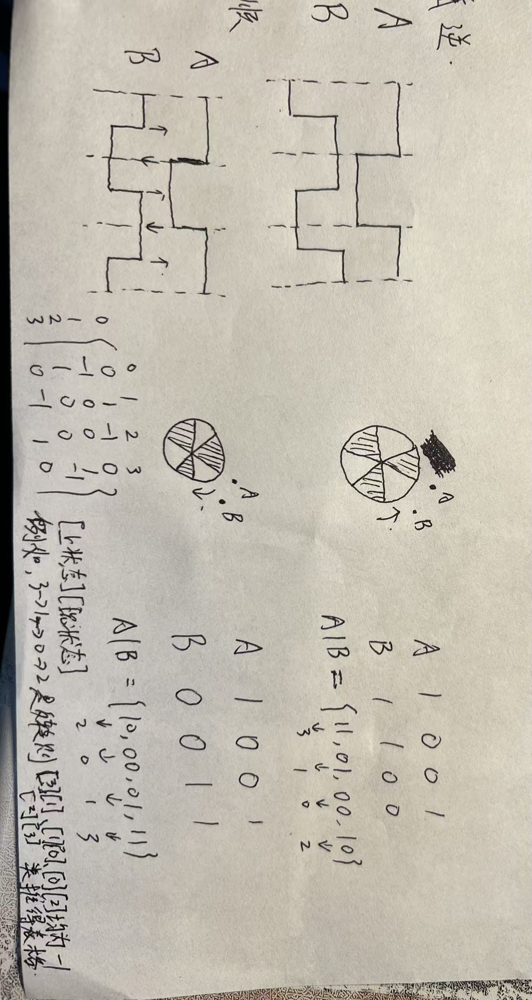

# 近期学习内容
## 学习怎么用达妙上位机给电机设置参数
 - ["调试助手使用说明书"](./调试助手使用说明书（达妙驱动控制协议）V1.4.pdf)
## 关于达妙电机的速度 速度位置 MIT模式的原理
 - ["DM-J4310说明书"](./DM-J4310-2EC%20V1.2减速电机说明书初稿最新.pdf)
## 读取imu数据,让达妙电机更随c板旋转
 - 启用imu,注意将imu的初始化放置于Task_Init()的末尾,因为程序会一直卡在imu的初始化,所以放末尾不影响其他中断的启用;
 - 达妙电机需要用额外的一个初始化函数来使能;
 - imu和达妙电机都有一个计算的方法需要再定时回调使用;
 - 把imu读取的数据赋值给达妙电机的目标位置就可以了
 - 注意达妙电机和c板的can线线序有些区别
## 用 stm32f103c8t6 读取编码器计数并通过串口转发
 - 用gpio模拟编码器模式
 - 列出正反转的情况,得到变化量表格,查表即可获得当前编码器状态;
 - 
## 用两个蓝牙模块实现不同32板的通信
 - 一帧完整的数据有 14 位，帧头为 0x5A，帧尾为 0x11
 - A单片机每 33ms 发送一次串口数据给蓝牙(主),蓝牙(主)发给蓝牙(从),蓝牙(从)再给B单片机,再解包;
## 测蓝牙通信的延迟
 - 一块 STM32 （A） 发送固定数据，发送时记录下当前的时间或者定时器计数值，另一块（B） 接收到数据后原封不动传回，A 接收到之后计算两次之间定时器的差值再除以二，可以得到单向通信的延迟 