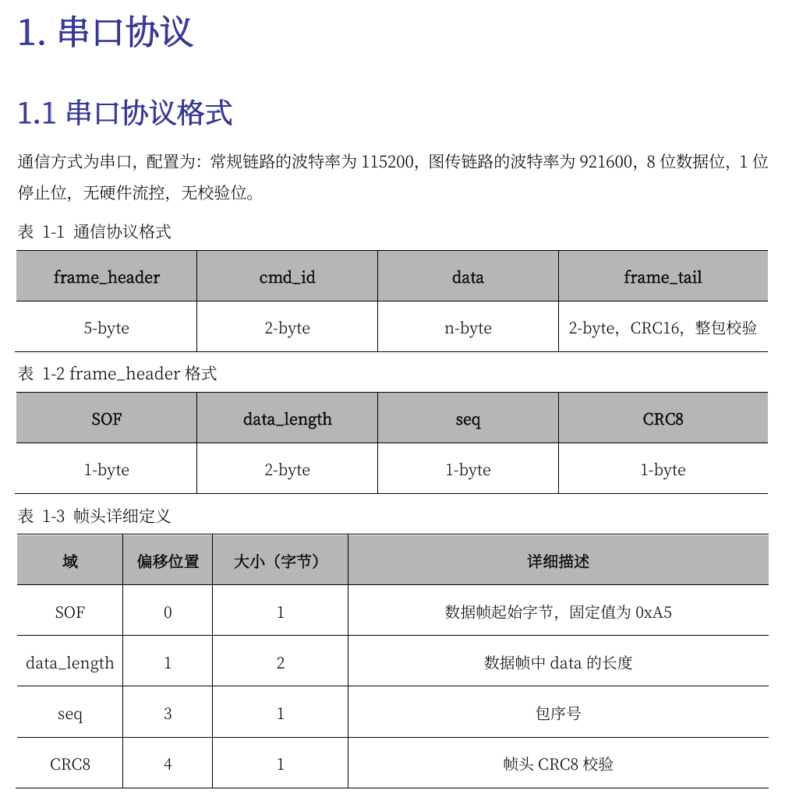

# 裁判系统学习记录
## 硬件
### 电源管理模块
- 作用:

    - 为底盘、云台、发射机构供24V电；
    - 检测三者的电流电压并计算功率；
    - 供5V、12V、24V电给其他裁判模块;
    - 模块间的转发通信;
    - 输出裁判系统相关信息;
### 装甲模块
#### 类别
- 大装甲
- 小装甲
- 支架
#### 作用
- 感知弹丸攻击和碰撞
### 测速模块
#### 类别
- 17mm SM01
- 43mm SM11
#### 作用
- 测定弹丸速度和频率,并通过can通信发给裁判系统主控模块
### 相机图传模块
#### 类别
- 接收端VT13
- 发送端VT03
#### 作用
- 接收端:

    - 数据传输
    - 图像输出
    - 发送遥控数据

- 发送端:

    - 图像采集
    - 数据传输

### 定位模块
#### 作用
- 与场地基地通信实现定位,数据通过电源管理模块用户接口输出
### 场地交互模块
#### 作用
- 与主控模块和电源管理模块配合使用实现IC卡的写入与读取操作

### 灯条模块
#### 作用
- 显示血量和状态

### 超级电容管理模块
#### 作用
- 可检测超级电容模组的容值，实时监控其电压和容量

### 场地交互卡
#### 作用
- 配合裁判系统场地交互模块，可以实现该IC卡的写入与读取操作

### 主控模块
#### 作用
- 监控整个系统的运行状态

    - 人机交互
    - 无线通信
    - 状态显示

## 软件
### 服务器(ROboMaster Server)
#### 作用
- 实时采集赛场数据
- 毫秒级赛事裁决
### 选手端(RoboMaster Client)
#### 作用
- 显示实时数据
- 选手第一视角操作

## 通信协议
### 串口协议格式
- 波特率:

    - 常规链路: 115200
    - 图传链路: 921600
    - 数据位: 8位
    - 停止位: 1位
    - 硬件流控: 无
    - 校验位: 无

#### 格式如图:

## 移植
### 报错后执行的操作记录
- config.h:

    - 注释掉了
- Data_Processs,witch里面没有列举枚举完全;

    - 添加了default情况,然后index++;

- 无法测到数据,debug发现卡在了imu的初始化，但是imu一直是能收到数据的；

    - 注释掉了imu；