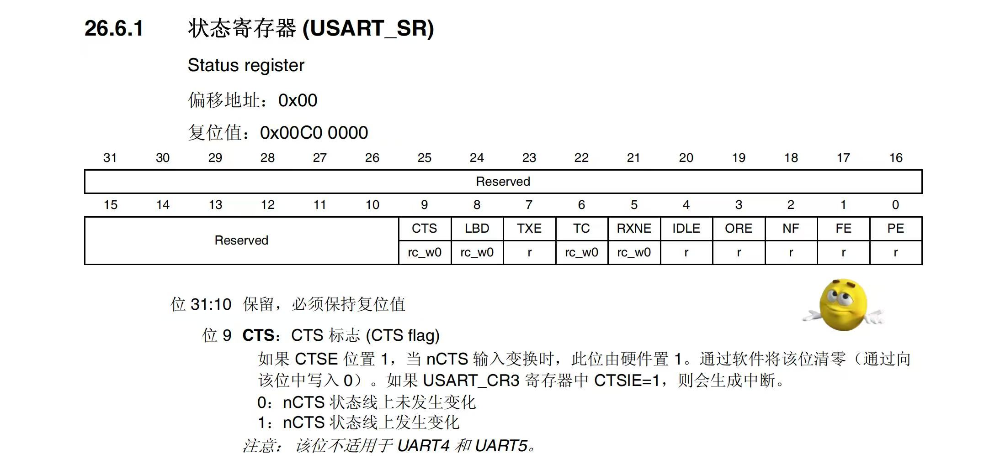
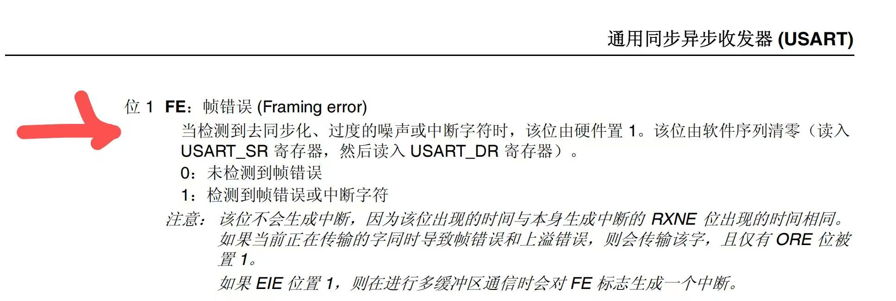
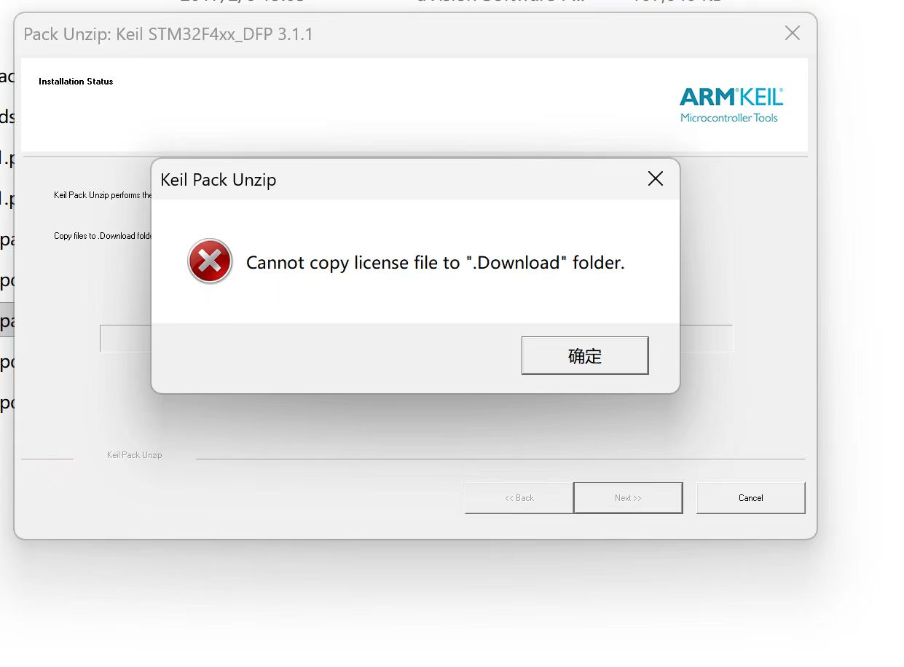
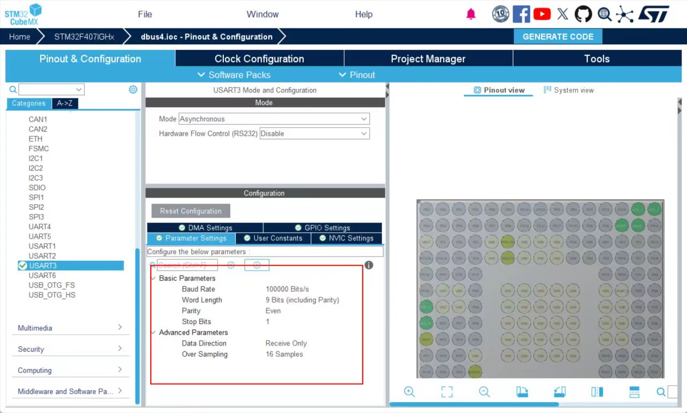
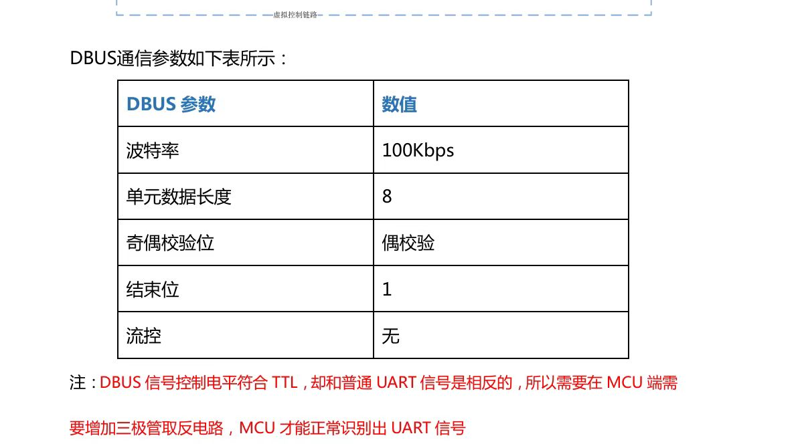

# DBUS
## 遇到的问题及解决办法
 ### 1.errorcode04 FE帧错误
   可能由于噪音，FE被硬件置1
   
   
 ### 解决办法：
 方案一：在main.c/USER CODE END 4/里重新写一遍weak函数处理（可行）
 ```c
    void HAL_UART_ErrorCallback(UART_HandleTypeDef *huart)
{
    if (huart->Instance == USART3)
    {
        if (huart->ErrorCode & HAL_UART_ERROR_FE)
        {
            // 
            __HAL_UART_CLEAR_FLAG(huart, UART_FLAG_FE);
            // 
        	huart->RxState = HAL_UART_STATE_READY;
            //
            __HAL_UART_ENABLE_IT(huart, UART_IT_IDLE);
        }
        
        //
       HAL_UARTEx_ReceiveToIdle_DMA(&huart3,buffer,18);
    }
}
```

 方案二：在stm32f4xx_it.c文件中的USART3_IRQHandler加入处理代码
```c#
    void USART3_IRQHandler(void)
    {
    /* USER CODE BEGIN USART3_IRQn 0 */
    if (__HAL_UART_GET_FLAG(&huart3, UART_FLAG_FE) != RESET)
    {
    HAL_UART_DMAStop(&huart3);
    ATOMIC_SET_BIT(huart3.Instance->CR3, USART_CR3_EIE);
    extern uint8_t buffer[];	
    HAL_UARTEx_ReceiveToIdle_DMA(&huart3,buffer,50);
    }
    /* USER CODE END USART3_IRQn 0 */
    HAL_UART_IRQHandler(&huart3);
    /* USER CODE BEGIN USART3_IRQn 1 */
    /* USER CODE END USART3_IRQn 1 */
    }   
```
### 2.在keil5里面装f4芯片安装包
下载3.1.1版本始终无法成功，出现Cannot copy license file to“.download”folder


### 解决办法：去官网下载版本更低的芯片安装包（和keil5版本适配）或者更新keil，最后下了2.16.0

### 3.数据错位及不正常
#### 经验：定长18 用normal mode；不定长 用normal mode
##### 学长的解释：对于串口异步通信的话，我们接收大的数据流的时候采用DMA模式，对于定长的数据包采用normal模式：每一次接收完数据后需要重新配置串口dma参数并使能，可以保证每一次接收到的数据都是从缓冲区的首字节开始存放的。对于不定长的数据包，我们采用circul模式，只需配置和使能一次就好，不过需要注意的是，数据缓冲区大小有限，在接收超过缓冲区长度的数据后，多余的数据会重新从缓冲区的首字节填充，“循环”，所以有的同学虽然用了circul模式，但是数据错位是这个原因

###### cubemx正确配置：


###### cubemx错误配置：
 ###### Word length：8

 ###### Parity：none
 
## 收获
#### 1.dbus发送数据周期（查数据手册）远长于数据发送所需时间（用can波特率算）->可以选用如下函数
```
void HAL_UARTEx_RxEventCallback(UART_HandleTypeDef *huart,uint16_t Size)
```
HAL库-串口空闲中断（一般+DMA接收不定长数据）

基本框架（normal模式下）
```c
MX_DMA_Init();
MX_USART3_UART_Init();//cubemx自动生成
uint8_t buffer[50]={0};//自定义
HAL_UARTEx_ReceiveToIdle_DMA(&huart3,buffer,18);
void HAL_UARTEx_RxEventCallback(UART_HandleTypeDef *huart,uint16_t Size){
    //数据处理
       HAL_UARTEx_ReceiveToIdle_DMA(&huart3,buffer,18);
}
```
#### 2.简单的归一化处理
###### 第一步：定义基准值
```c
#define _MIN 364
#define _MAX 1684
#define _MID 1024
#define _DEN (_MAX-_MID)
```
###### 第二步：限幅（可省）
```c
#define CONSTRAIN(x, min, max) ((x) < (min) ? (min) : ((x) > (max) ? (max) : (x)))
```
###### 第三步：归一化（-1~+1）
##### 归一化值 = (限幅后的原始值 - 中间值_MID) / 缩放因子_DEN
```c
	RC_Ctrl._ch0 = (float)(ch0_constrain - _MID) / _DEN;
    RC_Ctrl._ch1 = (float)(ch1_constrain - _MID) / _DEN;
    RC_Ctrl._ch2 = (float)(ch2_constrain - _MID) / _DEN;
    RC_Ctrl._ch3 = (float)(ch3_constrain - _MID) / _DEN;
```
#### 3.dbus的数据处理
```c
    RC_Ctrl.ch0 = ((int16_t)buffer[0] | ((int16_t)buffer[1] << 8)) & 0x07FF;  
    RC_Ctrl.ch1 = (((int16_t)buffer[1] >> 3) | ((int16_t)buffer[2] << 5)) 
& 0x07FF; 
    RC_Ctrl.ch2 = (((int16_t)buffer[2] >> 6) | ((int16_t)buffer[3] << 2) | 
                         ((int16_t)buffer[4] << 10)) & 0x07FF; 
    RC_Ctrl.ch3 = (((int16_t)buffer[4] >> 1) | ((int16_t)buffer[5]<<7)) & 
0x07FF; 
     
    RC_Ctrl.s1 = ((buffer[5] >> 4) & 0x000C) >> 2; 
    RC_Ctrl.s2 = ((buffer[5] >> 4) & 0x0003);
```


