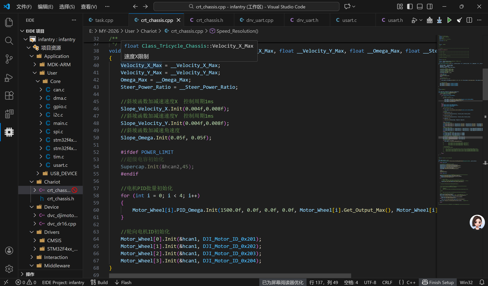
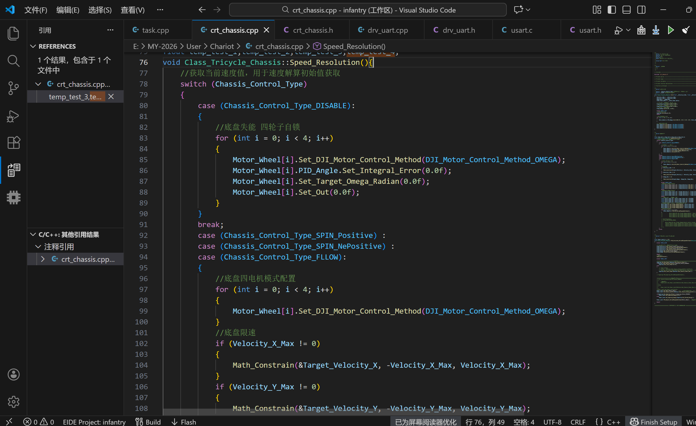

# 代码移植篇.底盘控制
# 一.chassis
## crt_chassis.cpp里面一共有
```c
void Class_Tricycle_Chassis::Init(float __Velocity_X_Max, float __Velocity_Y_Max, float __Omega_Max, float __Steer_Power_Ratio)
void Class_Tricycle_Chassis::Speed_Resolution()//速度解算
void Class_Tricycle_Chassis::TIM_Calculate_PeriodElapsedCallback(Enum_Sprint_Status __Sprint_Status)
```
这三个函数
###### 😊TIM_Calculate_PeriodElapsedCallback中包含了Speed_Resolution；
## 1.void Class_Tricycle_Chassis::Init(float __Velocity_X_Max, float __Velocity_Y_Max, float __Omega_Max, float __Steer_Power_Ratio)
### 先定义Class_Tricycle_Chassis chassis；
### chassis.Init(4.0f,4.0f,8.0f,0.5f);
###### 😊chassis底盘初始化中除了初始化4个数值外，还包含了电机Init（）和电机PID的Init（设置了Kp，Ki，Kd......）；



## 2.Class_Tricycle_Chassis::Speed_Resolution();
这个函数先判断Chassis_Control_Type的值,其取值有以下四种：
```c
enum Enum_Chassis_Control_Type :uint8_t
{
    Chassis_Control_Type_DISABLE = 0,//失能
    Chassis_Control_Type_FLLOW,      //底盘随云台动
    Chassis_Control_Type_SPIN_Positive,//小陀螺正转
    Chassis_Control_Type_SPIN_NePositive,//小陀螺反转
};
```
在进入下面三种模式后，都选择JI_Motor_Control_Method_OMEGA
```c
//底盘四电机模式配置
for (int i = 0; i < 4; i++)
{   Motor_Wheel[i].Set_DJI_Motor_Control_Method(DJI_Motor_Control_Method_OMEGA);
}
```



.png)
.png)
接下来就是解算。

## 3.void Class_Tricycle_Chassis::TIM_Calculate_PeriodElapsedCallback(Enum_Sprint_Status __Sprint_Status)
Enum_Sprint_Status __Sprint_Status选择使能还是失能；
接着在这个函数里边执行Class_Tricycle_Chassis::Speed_Resolution();

### 【总结】：一定要自己补的有这几行（补法不唯一）
```c
Class_Tricycle_Chassis chassis;
chassis.Init(4.0f,4.0f,8.0f,0.5f);//速度4m/s
chassis.Set_Chassis_Control_Type(Chassis_Control_Type_FLLOW);//为什么要写这一行呢？🧐因为Speed——Resolution里面要判断模式。既然要判断总得先赋值吧
chassis.TIM_Calculate_PeriodElapsedCallback(Sprint_Status_ENABLE);//一会儿往上面1msTIM移（因为Task_Init只执行一次，而Task1ms_TIM5_Callback每隔1ms就执行），再说一遍：里面已经有内部函数void Speed_Resolution();
```

# 二.dji3508电机
## 1.dvc_djimotor.h
开头包含：
大疆状态（控制动与不动）；大疆电机ID的枚举；大疆电机的控制方式；大疆电机源数据（can反馈的原始值）；处理过后的数据
还有一些单个数据，比如：
```c
    //电机上电第一帧标志位
    uint8_t Start_Falg = 0;

    //之后还有这个
    if(Start_Falg==0)  Start_Falg = 1;
```
Q：为什么要有第一帧标志位的设计🧐

A：已知“电机首次启动时，Data.Pre_Encoder是未初始化的垃圾”，这一步可以避免首次数据无效。


##### 说明：class Class_DIJ_Motor_C620  这是关于dji3508电机的类（因为其电调是C620）

## 2.dvc_djimotor.cpp里面（补充；最开始包含allocate_tx_data的定义）
### 1.电机初始化(难点)
注意是一个电机一个电机分别初始化的，这样并不会“打架”。
```c
void Class_DJI_Motor_C620::Init(CAN_HandleTypeDef *hcan, Enum_DJI_Motor_ID __CAN_ID, Enum_DJI_Motor_Control_Method __DJI_Motor_Control_Method, float __Gearbox_Rate, float __Torque_Max)
{
    if (hcan->Instance == CAN1)
    {
        CAN_Manage_Object = &CAN1_Manage_Object;
    }
    else if (hcan->Instance == CAN2)
    {
        CAN_Manage_Object = &CAN2_Manage_Object;
    }
    CAN_ID = __CAN_ID;
    DJI_Motor_Control_Method = __DJI_Motor_Control_Method;
    Gearbox_Rate = __Gearbox_Rate;
    Torque_Max = __Torque_Max;
    this->CAN_Tx_Data = allocate_tx_data(hcan, __CAN_ID);
}
```
核心作用：分配发送缓存区的地址给CAN_Tx_Data

具体逻辑如下：
```c
uint8_t *allocate_tx_data(CAN_HandleTypeDef *hcan, Enum_DJI_Motor_ID __CAN_ID)
{
    uint8_t *tmp_tx_data_ptr;
    if (hcan == &hcan1)
    {
        switch (__CAN_ID)
        {
        case (DJI_Motor_ID_0x201):
        {
            tmp_tx_data_ptr = &(CAN1_0x200_Tx_Data[0]);
        }
        break;
        case (DJI_Motor_ID_0x202):
        {
            tmp_tx_data_ptr = &(CAN1_0x200_Tx_Data[2]);
        }
        break;
        case (DJI_Motor_ID_0x203):
        {
            tmp_tx_data_ptr = &(CAN1_0x200_Tx_Data[4]);
        }
        break;
        case (DJI_Motor_ID_0x204):
        {
            tmp_tx_data_ptr = &(CAN1_0x200_Tx_Data[6]);
        }
        break;
        }
    }
    if (hcan == &hcan2){
        //省略
    }
        //省略部分代码
        return (tmp_tx_data_ptr);//返回值为指针存放地址
}
```
【说明】😎😎😎

原理：根据传入的CAN 外设句柄（区分hcan1/hcan2）和大疆电机 ID（枚举类型），返回对应的CAN 发送数据缓冲区的指针（uint8_t*）。

背景：大疆电机（如 C620、GM6020、M3508 等）的 CAN 控制协议采用“单帧多电机”的高效设计：一个 8 字节的 CAN 发送帧（CAN 数据帧最大长度为 8 字节）可以拆分为4 个 2 字节的控制段，分别对应 4 个不同 ID 的电机（每个电机的控制指令为 2 字节，如电流指令）。

另外，在drv_can.cpp文件中定义了
```c
    Struct_CAN_Manage_Object CAN1_Manage_Object = {0};
    Struct_CAN_Manage_Object CAN2_Manage_Object = {0};
```
并且在drv_can.h里面有
```c
struct Struct_CAN_Manage_Object
{
    CAN_HandleTypeDef *CAN_Handler;
    Struct_CAN_Rx_Buffer Rx_Buffer;
    CAN_Call_Back Callback_Function;
};
```c
其中Struct_CAN_Rx_Buffer也在drv_can.h

/**
 * @brief CAN接收的信息结构体
 *
 */
struct Struct_CAN_Rx_Buffer
{
    CAN_RxHeaderTypeDef Header;
    uint8_t Data[8];
};
```

另另外在drv_can.h里面还有

```c
//绑定的CAN
    Struct_CAN_Manage_Object *CAN_Manage_Object;
```
### 2.数据处理
    void Class_DJI_Motor_C620::Data_Process()
【功能】解析电机通过 CAN 反馈的原始数据，计算电机的角度、角速度、扭矩等物理量，并处理编码器圈数累计。
### 🤣😂🤣难点
Q：处理编码器圈数这是不是跟时间有关？剩下的一圈会在下一次数据处理时继续判定？🧐

A：哪怕极端情况下电机单次间隔内转了 2 圈，后续的 CAN 数据会通过新的编码器差值，再次触发跨圈判断，最终Total_Round会修正为实际的圈数。

1.**编码器数值持续更新**：电机的编码器值会随着转动不断变化，下一次收到的tmp_encoder会基于本次的tmp_encoder继续变化，新的差值会反映之前未被判定的圈数。

2.**代码逐次修正圈数**：代码的逻辑是每次数据处理只修正一次圈数（±1），但会通过多次数据处理，逐步累加总圈数，最终覆盖电机实际转动的圈数。

3.**工程场景的合理性**：CAN 通信周期极短，电机单次间隔内转多圈的情况几乎不存在，因此 “剩余圈数在下一次判定” 是理论上的补充逻辑，实际中几乎不会触发，但代码的设计仍能兼容这种极端情况。
### 3.CAN通信接收回调函数(Rx_Data 接收的数据)
```c
void Class_DJI_Motor_C620::CAN_RxCpltCallback(uint8_t *Rx_Data)
{
    //滑动窗口, 判断电机是否在线
    Flag += 1;

    Data_Process();
}
```
函数2在函数3里面，函数3里面的Flag又与函数4有关
### 4.TIM定时器中断定期检测电机是否存活
    void Class_DJI_Motor_C620::TIM_Alive_PeriodElapsedCallback()
### 5.TIM定时器中断计算回调函数
先判断电机控制模式，最终输出out
```c
void Class_DJI_Motor_C620::TIM_PID_PeriodElapsedCallback()
{
    switch (DJI_Motor_Control_Method)
    {
    case (DJI_Motor_Control_Method_OPENLOOP):
    {
        //默认开环扭矩控制
        Out = Target_Torque / Torque_Max * Output_Max;
    }
    break;
    case (DJI_Motor_Control_Method_TORQUE):
    {
        //默认闭环扭矩控制
        Out = Target_Torque / Torque_Max * Output_Max;
    }
    break;
    case (DJI_Motor_Control_Method_OMEGA):
    {
        PID_Omega.Set_Target(Target_Omega_Radian);
        PID_Omega.Set_Now(Data.Now_Omega_Radian);
        PID_Omega.TIM_Adjust_PeriodElapsedCallback();

        Out = PID_Omega.Get_Out();
    }
    break;
    case (DJI_Motor_Control_Method_ANGLE):
    {
        PID_Angle.Set_Target(Target_Radian);
        PID_Angle.Set_Now(Data.Now_Radian);
        PID_Angle.TIM_Adjust_PeriodElapsedCallback();

        Target_Omega_Radian = PID_Angle.Get_Out();

        PID_Omega.Set_Target(Target_Omega_Radian);
        PID_Omega.Set_Now(Data.Now_Omega_Radian);
        PID_Omega.TIM_Adjust_PeriodElapsedCallback();

        Out = PID_Omega.Get_Out();
    }
    break;
    default:
    {
        Out = 0.0f;
    }
    break;
    }
    Output();
}
```
函数5调用后也包含了函数6，将PID输出的Out值赋给了发送缓存区。
而且Class_Tricycle_Chassis::Speed_Resolution()中调用了这个函数！

✌️✌️✌️*！！！PID与CAN的连接*
### 6.电机数据输出到CAN总线发送缓冲区
```c
void Class_DJI_Motor_C620::Output()
{
    CAN_Tx_Data[0] = (int16_t)Out >> 8;
    CAN_Tx_Data[1] = (int16_t)Out;
}
```
😊😊😊前面已经提到 分配发送缓存区的地址给CAN_Tx_Data，那么接下来给这个地址下面的[0][1]赋值PID输出值，其实就是给发送缓存区对应位置赋值。

### 【总结】：一定要自己再补代码的是函数1和3，函数5似乎是可选项。
还有个问题，那么Out的值从哪儿来呢？ ------看函数5。
### 【summary】
1、初始化：绑定 CAN 总线、配置参数、分配缓冲区。

2、数据接收：CAN 中断接收电机反馈数据，标记在线状态。

3、数据处理：解析原始数据，计算角度、角速度等物理量。

4、PID 控制：定时器中断执行 PID 算法，根据控制方式输出指令。

5、数据发送：将控制指令拆分为字节，存入 CAN 发送缓冲区。

6、在线检测：定时器定期检测电机是否在线，处理离线保护逻辑。
# 三.CAN
## 1.can Init
    void CAN_Init(CAN_HandleTypeDef *hcan, CAN_Call_Back Callback_Function)
先初始化CAN编号，再初始化Callback_Function 处理回调函数；把这二者赋给CAN1_Manage_Object
```c
Struct_CAN_Manage_Object CAN1_Manage_Object = {0};

/**
 * @brief CAN通信接收回调函数数据类型
 *
 */
typedef void (*CAN_Call_Back)(Struct_CAN_Rx_Buffer *);

/**
 * @brief CAN通信处理结构体
 *
 */
struct Struct_CAN_Manage_Object
{
    CAN_HandleTypeDef *CAN_Handler;
    Struct_CAN_Rx_Buffer Rx_Buffer;
    CAN_Call_Back Callback_Function;
};

/**
 * @brief CAN接收的信息结构体
 *
 */
struct Struct_CAN_Rx_Buffer
{
    CAN_RxHeaderTypeDef Header;
    uint8_t Data[8];
};

```

接着调用
can_filter_mask_config()配置过滤器

这个函数的最后包含了

    /*离开初始模式*/
    HAL_CAN_Start(hcan);				
    
    /*开中断*/
    HAL_CAN_ActivateNotification(hcan, CAN_IT_RX_FIFO0_MSG_PENDING);       //can 接收fifo 0不为空中断
	HAL_CAN_ActivateNotification(hcan, CAN_IT_RX_FIFO1_MSG_PENDING);       //can 接收fifo 1不为空中断
## 2.CAN发送数据帧
```c
uint8_t CAN_Send_Data(CAN_HandleTypeDef *hcan, uint16_t ID, uint8_t *Data, uint16_t Length)
{
    CAN_TxHeaderTypeDef tx_header;
    uint32_t used_mailbox;

    //检测传参是否正确
    assert_param(hcan != NULL);

    tx_header.StdId = ID;
    tx_header.ExtId = 0;
    tx_header.IDE = 0;
    tx_header.RTR = 0;
    tx_header.DLC = Length;

    return (HAL_CAN_AddTxMessage(hcan, &tx_header, Data, &used_mailbox));
}
```
## 3.CAN的TIM定时器中断发送回调函数
    void TIM_CAN_PeriodElapsedCallback()
！！在这个函数3下面放函数2。
eg：
```c
void TIM_CAN_PeriodElapsedCallback()
{   
    CAN_Send_Data(&hcan1,0x200,CAN1_0x200_Tx_Data,8);
}
```
## 4.HAL库CAN接收FIFO0中断
     void HAL_CAN_RxFifo0MsgPendingCallback(CAN_HandleTypeDef *hcan)
#### 硬件部分收到反馈数据便会触发
key代码：

     HAL_CAN_GetRxMessage(hcan, CAN_FILTER_FIFO1, &CAN1_Manage_Object.Rx_Buffer.Header, CAN1_Manage_Object.Rx_Buffer.Data);

### 【总结】：CAN部分只要初始化就行，其他不用管
# 四.DR16
## 1.Init（类似can）
## 2.按键判断
## 3.回调
## 4.处理数据

# 五.PID
## 1.Init
设置初始值
## 2.void Class_PID::TIM_Adjust_PeriodElapsedCallback()
通过pid调整后得到Out输出值来发送电流指令（😊pid与can衔接驱动电机motor）

# 六.串口
### 
```c
void UART_Init(UART_HandleTypeDef *huart, UART_Call_Back Callback_Function, uint16_t Rx_Buffer_Length);

uint8_t UART_Send_Data(UART_HandleTypeDef *huart, uint8_t *Data, uint16_t Length);

void TIM_UART_PeriodElapsedCallback();
```
# END
【注意点】

1.Init有顺序讲究（从下往上，eg必须初始化完can，再初始化motor）

2.
```c
if (HAL_CAN_ConfigFilter(&hcan, &can_filter_init_structure) != HAL_OK)
{
    Error_handler(); // 配置失败处理
}
```
误区：认为它只判断（有参数赋值且有HAL_CAN_ConfigFilter调用：才算真正配置了过滤器，规则会在硬件层面生效）
正解：这段代码的核心是先执行函数调用，再对调用结果做判断，而非 “仅判断不执行”。你产生 “只是判断” 的错觉，是因为代码把函数调用和结果校验合并在了同一条if语句中