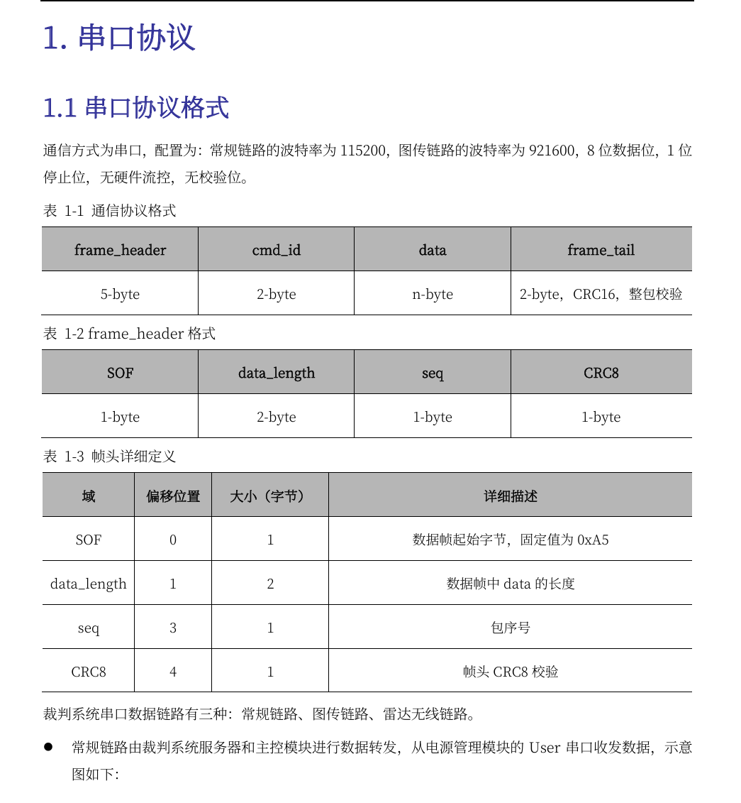
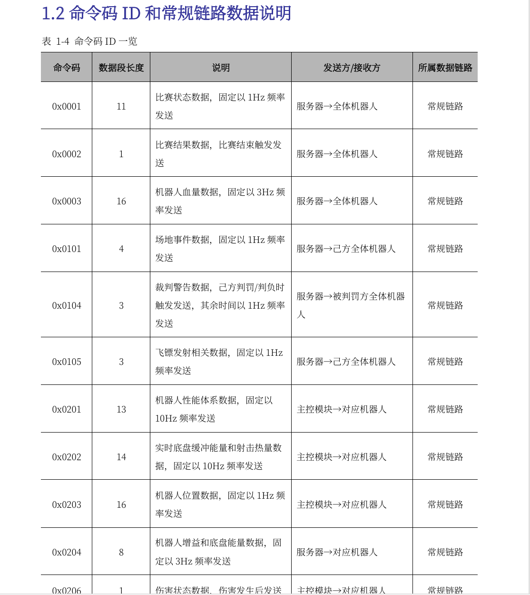
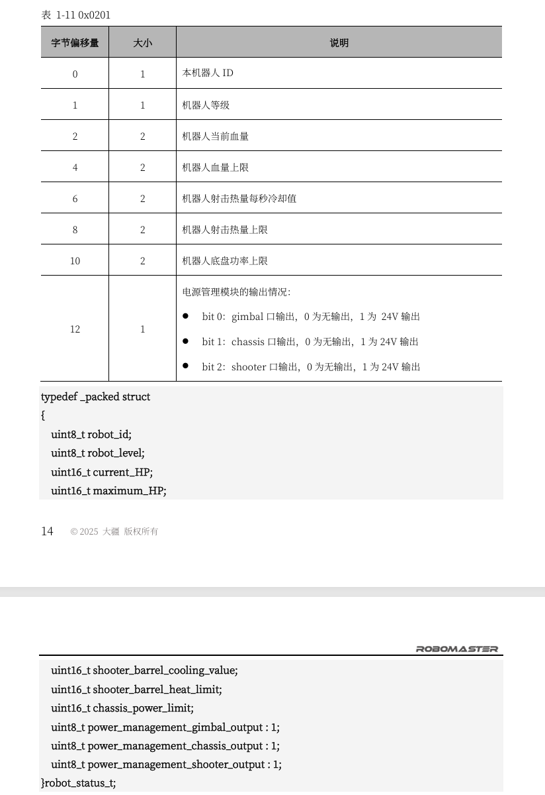

# RMUC2026赛事通信协议文件学习
## 一、串口协议
### 1.1串口协议格式

上图已经很清晰了
### 1.2命令码ID与常规链路数据说明

**🤔此处的命令码ID对应着上图的cmd_id;**

**🤔“数据段长度”（命令码表中的列）对应着数据帧里的 “data” 字段的长度**

#### 和dvc_referee.cpp的衔接
```c
   // 数据处理过程
   //从Rx缓存区中提取命令码ID
            cmd_id = (UART_Manage_Object->Rx_Buffer[Get_Circle_Index(buffer_index + 6)]) & 0xff;
            cmd_id = (cmd_id << 8) | UART_Manage_Object->Rx_Buffer[Get_Circle_Index(buffer_index + 5)];
            Enum_Referee_Command_ID CMD_ID = (Enum_Referee_Command_ID)cmd_id;
   //从Rx缓存区中提取data长度
            data_length = UART_Manage_Object->Rx_Buffer[Get_Circle_Index(buffer_index + 2)] & 0xff;
            data_length = (data_length << 8) | UART_Manage_Object->Rx_Buffer[Get_Circle_Index(buffer_index + 1)];
            Math_Constrain(&data_length,(uint16_t)0,(uint16_t)(128));  //限制数据段最大长度
```

其中
```c
/**
 * @brief 裁判系统命令码类型
 *
 */
enum Enum_Referee_Command_ID : uint16_t
{
    Referee_Command_ID_GAME_STATUS = 0x0001,
    Referee_Command_ID_GAME_RESULT,
    Referee_Command_ID_GAME_ROBOT_HP,
    Referee_Command_ID_GAME_DART_STATUS_DISABLED,
    Referee_Command_ID_GAME_AI_DISABLED,
    Referee_Command_ID_EVENT_DATA = 0x0101,
    Referee_Command_ID_EVENT_SUPPLY,
    Referee_Command_ID_EVENT_SUPPLY_REQUEST_DISABLED,
    Referee_Command_ID_EVENT_REFEREE_WARNING,
    Referee_Command_ID_EVENT_DART_REMAINING_TIME,
    Referee_Command_ID_ROBOT_STATUS = 0x0201,
    Referee_Command_ID_ROBOT_POWER_HEAT,
    Referee_Command_ID_ROBOT_POSITION,
    Referee_Command_ID_ROBOT_BUFF,
    Referee_Command_ID_ROBOT_AERIAL_ENERGY,
    Referee_Command_ID_ROBOT_DAMAGE,
    Referee_Command_ID_ROBOT_BOOSTER,
    Referee_Command_ID_ROBOT_REMAINING_AMMO,
    Referee_Command_ID_ROBOT_RFID,
    Referee_Command_ID_ROBOT_DART_COMMAND,
    Referee_Command_ID_INTERACTION = 0x0301,
    Referee_Command_ID_INTERACTION_CUSTOM_CONTROLLER,
    Referee_Command_ID_INTERACTION_RADAR_SEND,
    Referee_Command_ID_INTERACTION_REMOTE_CONTROL,
    Referee_Command_ID_INTERACTION_Client_RECEIVE,
};
```
### 1.3 举例
经过帧头的CRC8校验＋全帧的CRC16校验后，根据ID进入给结构体赋值阶段
```c
case (Referee_Command_ID_ROBOT_POSITION):
                    {
                        for (int i = 0; i < data_length + 2; i++)
                        {
                            reinterpret_cast<uint8_t *>(&Robot_Position)[i] = UART_Manage_Object->Rx_Buffer[Get_Circle_Index(buffer_index + 7 + i)];
                        }
                        buffer_index += sizeof(Struct_Referee_Rx_Data_Robot_Position) + 7;
                    }
                    break;
```

实际上仓库定义的代码
```c
/**
 * @brief 裁判系统经过处理的数据, 0x0201机器人状态, 10Hz发送
 *
 */
struct Struct_Referee_Rx_Data_Robot_Status
{
    Enum_Referee_Data_Robots_ID Robot_ID;
    uint8_t Level;
    uint16_t HP;
    uint16_t HP_Max;
    uint16_t Shooter_Barrel_Cooling_Value;
    uint16_t Shooter_Barrel_Heat_Limit;
    uint16_t Chassis_Power_Limit; 
    uint8_t PM01_Gimbal_Status_Enum : 1;
    uint8_t PM01_Chassis_Status_Enum : 1;
    uint8_t PM01_Booster_Status_Enum : 1;
    uint8_t Reserved : 5;
    uint16_t CRC_16;
} __attribute__((packed));
```
Q1: 枚举后面有个：1是为什么

A1:
###### 1. 先理解 “默认内存占用”
###### 正常情况下，uint8_t 类型的变量会占用 1 个字节（8 个二进制位），哪怕你只需要用它存 “0” 或 “1”（比如 “云台正常 / 异常”）—— 相当于用一个 8 格的抽屉，只放了 1 件东西，剩下 7 格全空着，很浪费。
###### 2. 位域（: 数字）的作用：拆分字节，节省内存
###### 位域语法 变量名 : 位数 就是把 1 个字节（或更大的类型）拆成多个 “小格子”，每个小格子只占指定的位数，精准利用内存。

Q2:结构体末尾的 __attribute__((packed)) 是什么？

A2:
###### 这个属性和位域配套使用，核心作用是禁止编译器自动 “字节对齐”：
###### 没有packed时，编译器可能为了访问效率，把 1 字节的位域强行对齐到 4 字节（比如本来 1 字节，占了 4 字节空间）；
###### 加了packed后，结构体的内存布局会 “紧凑排列”，和实际传输的字节完全一致（比如位域部分就是 1 字节，不会多占），避免接收数据时解析出错（这在通信场景中是必须的！）。
【注意】这个结构体不只是只有data，也包含frame_tail(CRC16两字节)😊🧐{这也是为什么处理时有“+2”的原因}

......未完待续

🤨文件最后附上了CRC代码示例和机器人ID。