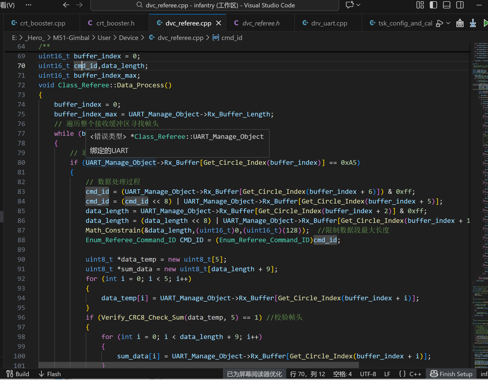
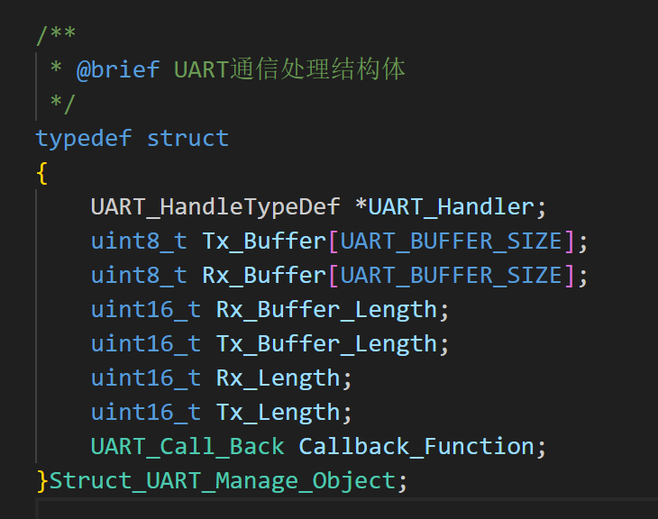
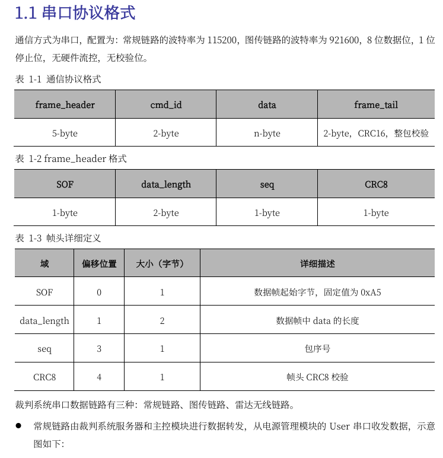
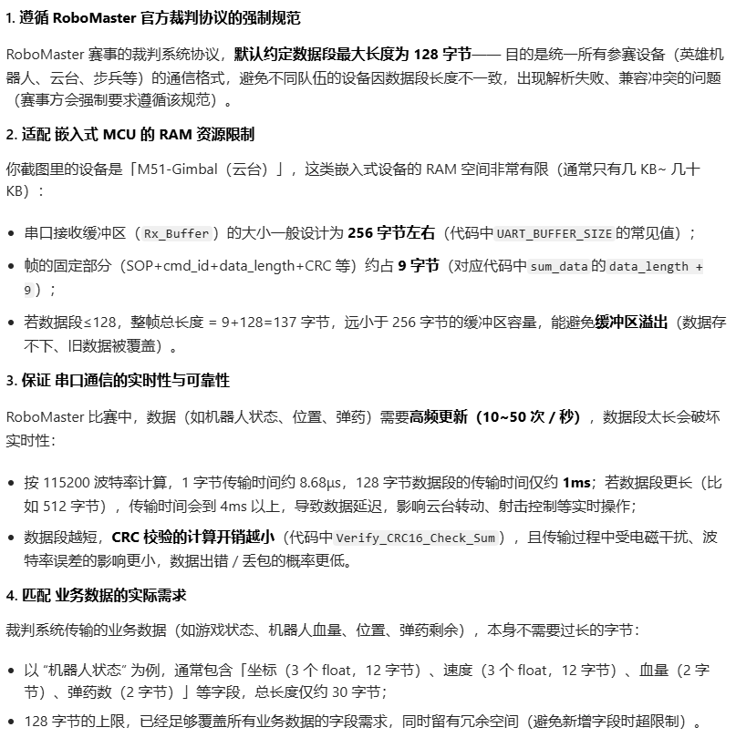
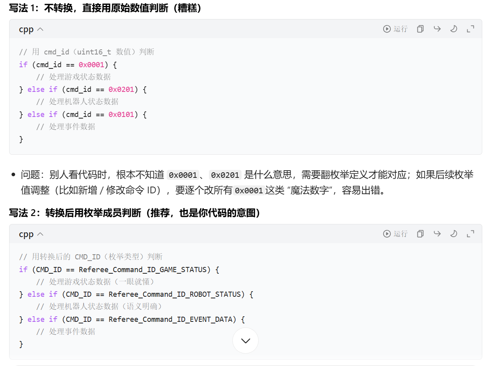
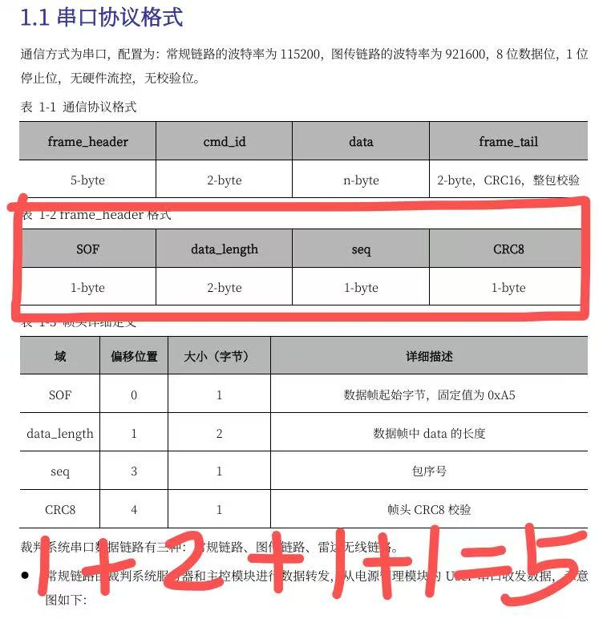
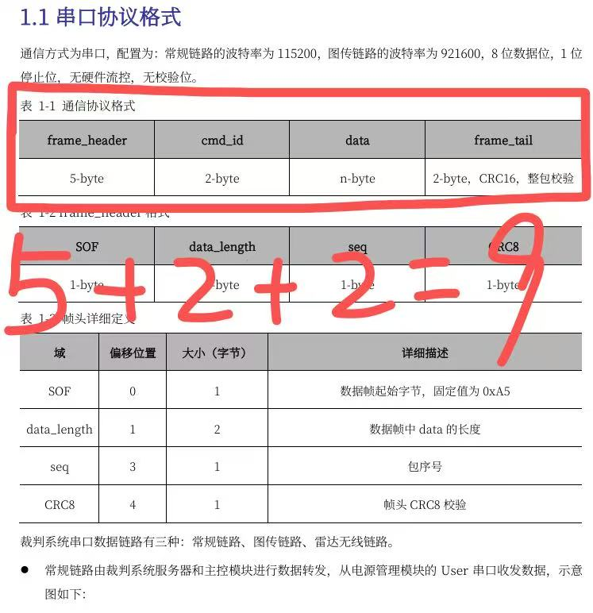
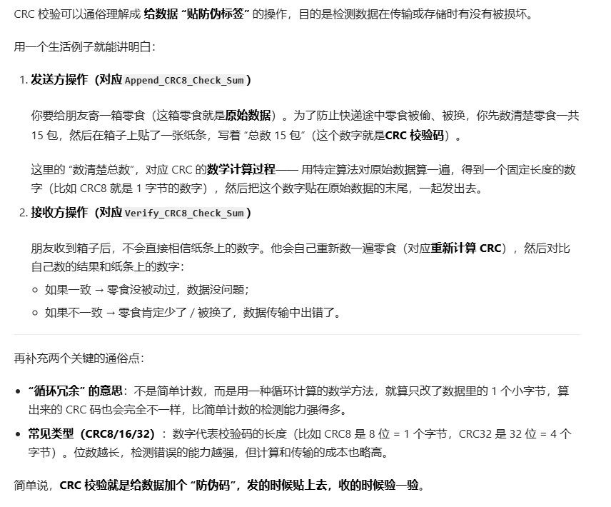

### 1.遍历整个接收缓存区Rx_Buffer(uint8_t类型)找到帧头buffer_index(RM官方协议规定为0xA5)
if判断语句找到帧头buffer_index后，执行接下来的操作。
### 2.根据串口协议格式处理得到cmd_id(接下来会被转化成枚举类型),data_length


Q1:

    cmd_id = (UART_Manage_Object->Rx_Buffer[Get_Circle_Index(buffer_index + 6)]) & 0xff;
为什么要加& 0xff？
###### A1:
###### 它不是 “转换类型”（C 语言类型不会变），而是 通过按位与的掩码作用，强制 “剥离” 数据的低 8 位原始字节值，同时清除高位的符号扩展位，从而实现 “有符号 char” 到 “无符号 8 位数值” 的逻辑转换。
###### 核心目的：避免符号扩展导致的数值失真；把 signed char 能表示的 [-128, 127]，映射回串口字节的真实范围 [0, 255]；确保 cmd_id 是字节的 “原始数值”，后续指令解析（比如 if(cmd_id == 0x80)）不会出错。
###### 补充：如果 Rx_Buffer 是 unsigned char，还需要这一步吗？
###### 不需要！因为 unsigned char 的存储范围是 [0, 255]，没有符号位，赋值给 int 时不会发生符号扩展（高位补 0），直接就是原始字节值。
###### 但嵌入式开发中，很多库或底层代码默认用 signed char 定义缓冲区（比如标准库的串口接收函数），所以 & 0xff 是 “兜底操作”，确保无论缓冲区是 signed 还是 unsigned，都能拿到正确的无符号命令 ID。
Q2:
```c
cmd_id = (UART_Manage_Object->Rx_Buffer[Get_Circle_Index(buffer_index + 6)]) & 0xff;
            cmd_id = (cmd_id << 8) | UART_Manage_Object->Rx_Buffer[Get_Circle_Index(buffer_index + 5)];
```
为什么顺序是这样子的?
###### A2:
###### 代码顺序必须和串口帧中「16 位 cmd_id 的字节排列顺序」完全匹配—— 帧里约定「第 5 偏移是低 8 位，第 6 偏移是高 8 位」，代码就必须先取高 8 位移位，再合并低 8 位，才能得到正确的 16 位数值。
Q3:为什么限制数据段最大长度是128?


Q4:枚举 Enum_Referee_Command_ID 是 RoboMaster 裁判系统的 16 位命令 ID 定义，为什么里面 “有的赋值、有的没赋值”？
###### A4：
###### 核心遵循 C++ 枚举的 “默认连续递增规则”，本质是为了 简化代码、清晰分组、避免冗余—— 没赋值的枚举量会自动在前一个枚举量的基础上 +1，不用手动写重复的连续数值。
###### 【总结】
###### 显式赋值的枚举量：定 “分组起始值” 或 “特殊值”，划分功能区间；
###### 未显式赋值的枚举量：自动在前一个值的基础上 +1，简化代码、避免冗余；
###### 最终目的：让命令 ID 的定义 “清晰、易维护、符合官方协议”，完美适配之前串口通信中 cmd_id 的解析逻辑（通过 cmd_id 匹配枚举值，执行对应功能）。

Q5：

     Enum_Referee_Command_ID CMD_ID = (Enum_Referee_Command_ID)cmd_id;
这段代码在干嘛？
###### A5：
###### 这段代码的核心是 “类型转换 + 语义绑定”：把从串口解析出的「原始数值型命令 ID（cmd_id）」，转换成「有明确语义的枚举类型（Enum_Referee_Command_ID）」，方便后续代码进行可读性更强、更安全的指令判断。
直观例子：

### 3.
#### 整体功能概述：
#### 1.从串口环形接收缓冲区中读取数据；
#### 2.通过 CRC 校验确保数据传输无误；
#### 3.根据不同的指令 ID（比如 “比赛状态”“机器人位置”），将字节流数据解析到对应的结构体中；
#### 4.维护缓冲区索引，避免重复解析或解析错位。
详细拆解：
1. 动态内存分配（临时存储校验数据）
```c
uint8_t *data_temp = new uint8_t[5];    // 临时存5字节帧头（用于CRC8校验）
uint8_t *sum_data = new uint8_t[data_length + 9];  // 临时存整帧数据（用于CRC16校验）
```
2. 读取帧头并做 CRC8 校验（帧头合法性检查）
```c
// 从环形缓冲区读取5字节帧头到data_temp
for (int i = 0; i < 5; i++)
{
    data_temp[i] = UART_Manage_Object->Rx_Buffer[Get_Circle_Index(buffer_index + i)];
}
// 校验帧头是否正确（CRC8是简单的字节校验，防止帧头传错）
if (Verify_CRC8_Check_Sum(data_temp, 5) == 1) 
```
3. 读取整帧数据并做 CRC16 校验（整帧完整性检查）
```c
// 读取整帧数据（长度=data_length+9）到sum_data
for (int i = 0; i < data_length + 9; i++)
{
    sum_data[i] = UART_Manage_Object->Rx_Buffer[Get_Circle_Index(buffer_index + i)];
}
// CRC16校验（比CRC8更严格，确保整帧数据无错）
if (Verify_CRC16_Check_Sum(sum_data, data_length + 9) == 1) 
```
##### 只有 CRC16 校验通过，才会进入后续的 “按指令 ID 解析数据” 环节。

4. 按指令 ID 解析数据到对应结构体（核心逻辑）
```c
switch (CMD_ID)
{
case Referee_Command_ID_GAME_STATUS:  // 比赛状态指令ID
{
    // 把缓冲区数据按字节拷贝到Game_Status结构体中
    for (int i = 0; i < data_length + 2; i++)
    {
        // 强制类型转换：把结构体地址转成字节数组，逐字节拷贝
        reinterpret_cast<uint8_t *>(&Game_Status)[i] = 
            UART_Manage_Object->Rx_Buffer[Get_Circle_Index(buffer_index + 7 + i)];
    }
    // 更新索引：跳过当前帧（结构体大小+7字节帧头），解析下一个帧
    buffer_index += sizeof(Struct_Referee_Rx_Data_Game_Status) + 7;
}
break;
// 其他case（机器人状态、位置、血量等）逻辑完全一致
}
```
##### 【关键细节】

##### CMD_ID：裁判系统定义的指令 ID（每个指令对应唯一 ID，比如Referee_Command_ID_GAME_STATUS是 “比赛状态”，Referee_Command_ID_ROBOT_POSITION是 “机器人位置”）；

##### 结构体（如Struct_Referee_Rx_Data_Game_Status）：和裁判系统数据帧格式一一对应（比如比赛状态包含 “剩余时间”“比赛阶段” 等字段）；

##### reinterpret_cast<uint8_t *>(&Game_Status)：强制类型转换（把结构体地址转成字节数组），目的是将串口的 “连续字节流” 拷贝到结构体的 “字段内存” 中；

##### buffer_index + 7 + i：7 是帧头偏移量（跳过帧头的 7 个字节，才是有效数据）；

##### buffer_index += ...：解析完当前帧后，索引向后移动，避免重复解析同一帧。
5. 内存释放 + 索引容错
```c
// 释放动态分配的内存（避免内存泄漏）
delete[] sum_data;
delete[] data_temp;
// 如果校验失败（帧头/整帧CRC错），索引只+1，尝试解析下一个字节（容错）
buffer_index++;
```
###### 如果 CRC 校验失败（比如帧错位），索引只 + 1，而不是跳过整帧，避免错过正确帧；
###### delete[]必须和new[]配对，否则会导致内存泄漏（单片机内存有限，泄漏会导致程序崩溃）。
🧐Q1:
```c
uint8_t *data_temp = new uint8_t[5];    // 临时存5字节帧头（用于CRC8校验）
uint8_t *sum_data = new uint8_t[data_length + 9];  // 临时存整帧数据（用于CRC16校验）
```
为什么一个是5，一个是9？

A1:



🧐Q2:为什么一个是2，一个是7？
```c
case (Referee_Command_ID_ROBOT_STATUS):
                    {
                        fps = FPS_Counter_Update();
                        for (int i = 0; i < data_length + 2; i++)
                        {
                            reinterpret_cast<uint8_t *>(&Robot_Status)[i] = UART_Manage_Object->Rx_Buffer[Get_Circle_Index(buffer_index + 7 + i)];
                        }
                        buffer_index += sizeof(Struct_Referee_Rx_Data_Robot_Status) + 7;
                    }
                    break;
```
###### A2：
（1）why是2？
###### for (int i = 0; i < data_length + 2; i++) 中的 +2 是长度维度，核心是 “把有效数据和后续的 CRC16 校验位一起读完”
再去看看结构体
###### 结构体（比如Game_Status）对应的是 “data + frame_tail” 这部分内容（因为结构体需要包含完整的有效数据 + 校验位）。
（2）why是7？
###### +7 是为了跳过帧头（5 字节）+ 指令 ID（2 字节），精准定位到「有效数据段」的起始位置。从而达到“把有效数据和后续的 CRC16 校验位一起读完”这个目的。
🧐Q3：

     buffer_index += sizeof(Struct_Referee_Rx_Data_Robot_Status) + 7;
这行代码的功能是？
###### A3:
###### 这行代码是解析完当前帧后，更新环形缓冲区的解析索引，核心目的是：跳过当前已经处理完成的整帧数据，让下一次解析从 “下一个新帧的起始位置” 开始，避免重复解析、解析错位。
##### 是环形缓冲区解析数据的 “收尾关键步骤”。

### 【补充】😊😊😊CRC的通俗理解

说的专业一点，就是：
###### CRC8（8 位循环冗余校验）是一种轻量级错误检测算法，通过对原始数据计算出一个 8 位（1 字节）的校验值（CRC 值），将其与原始数据一起存储 / 传输。接收方重新计算原始数据的 CRC 值，与附加的校验字节对比：一致则数据无误，不一致则数据损坏。。