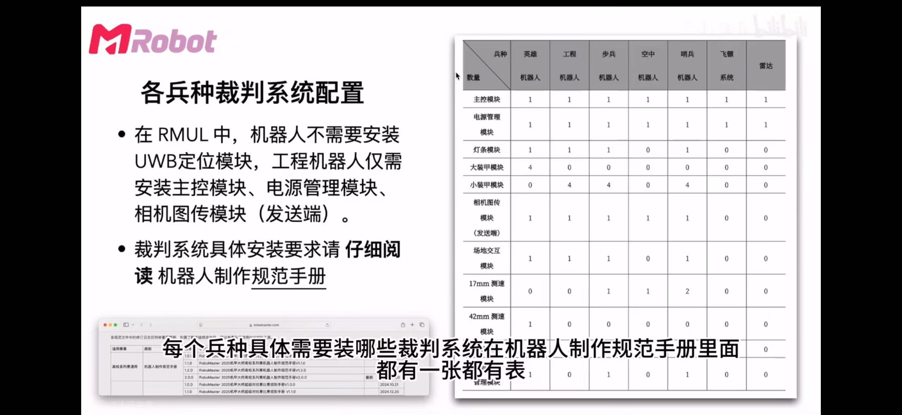
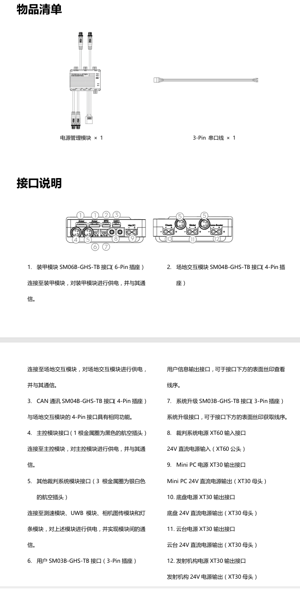
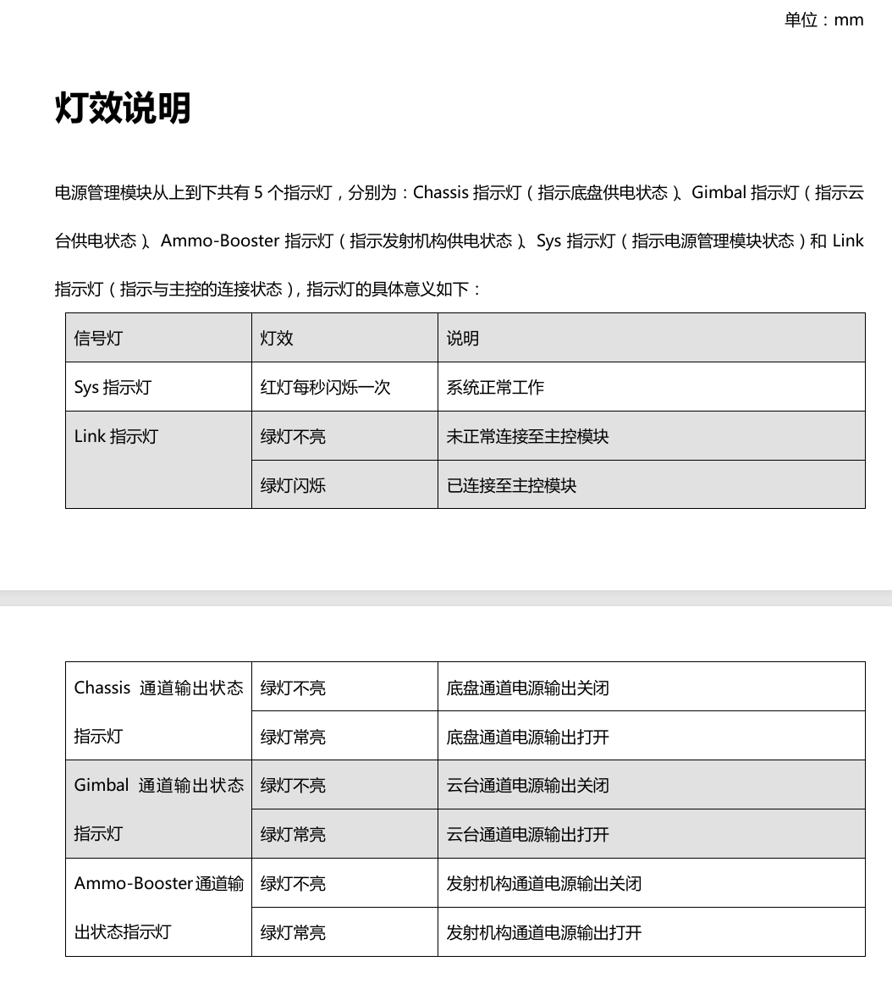
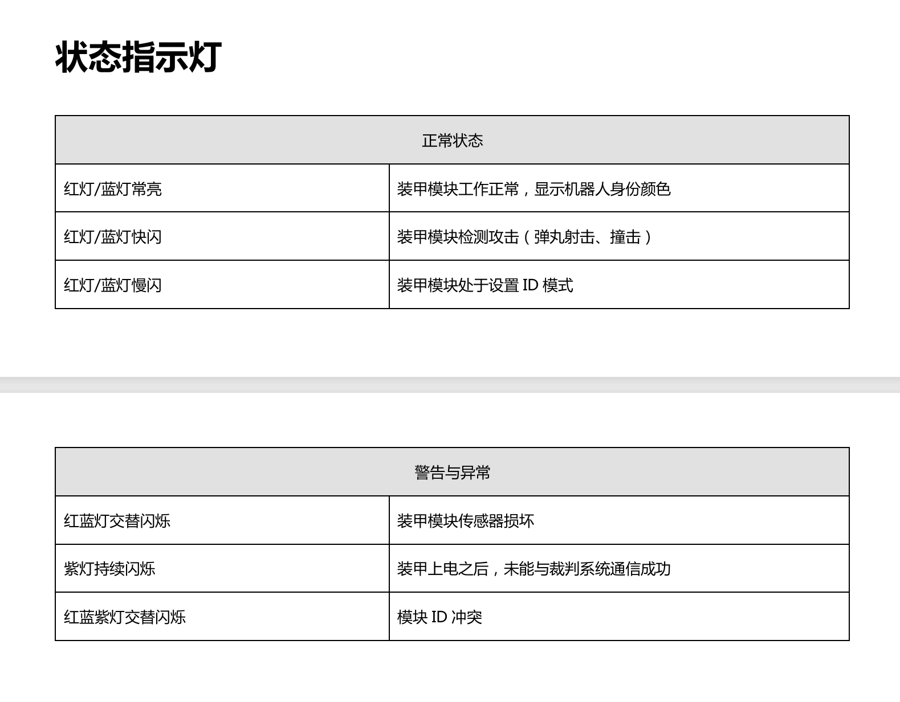
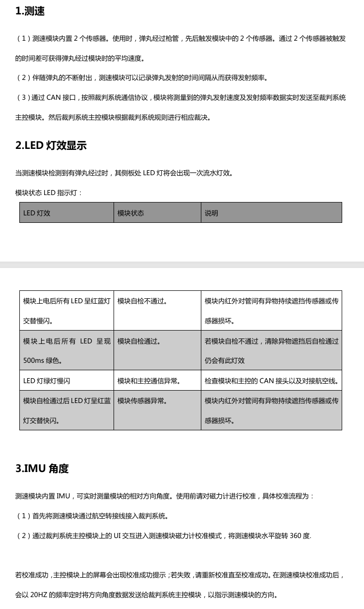
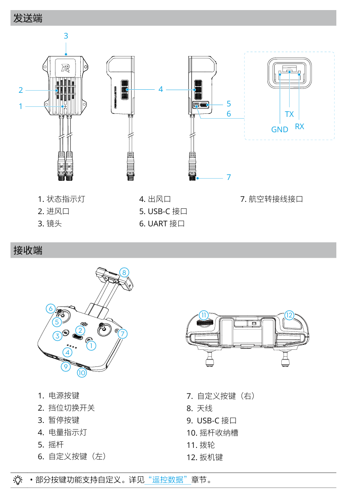
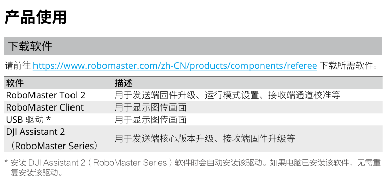
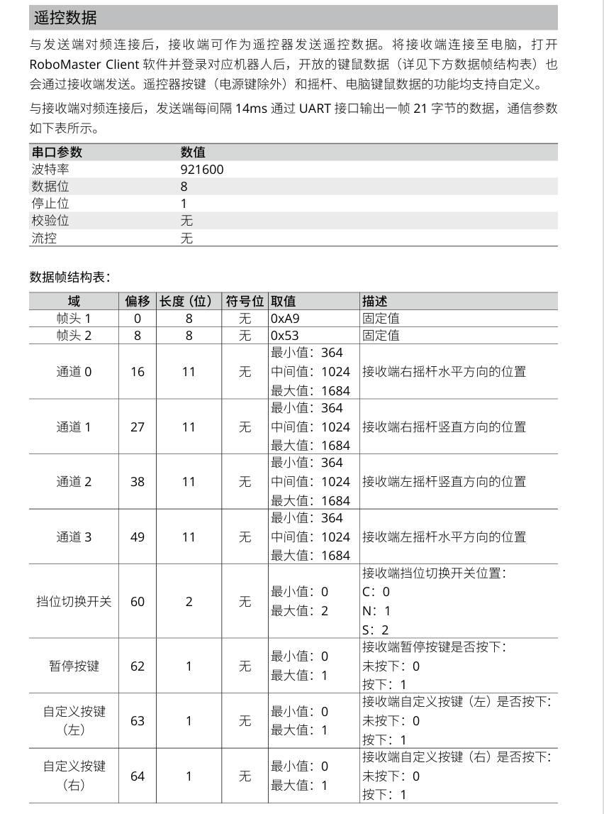
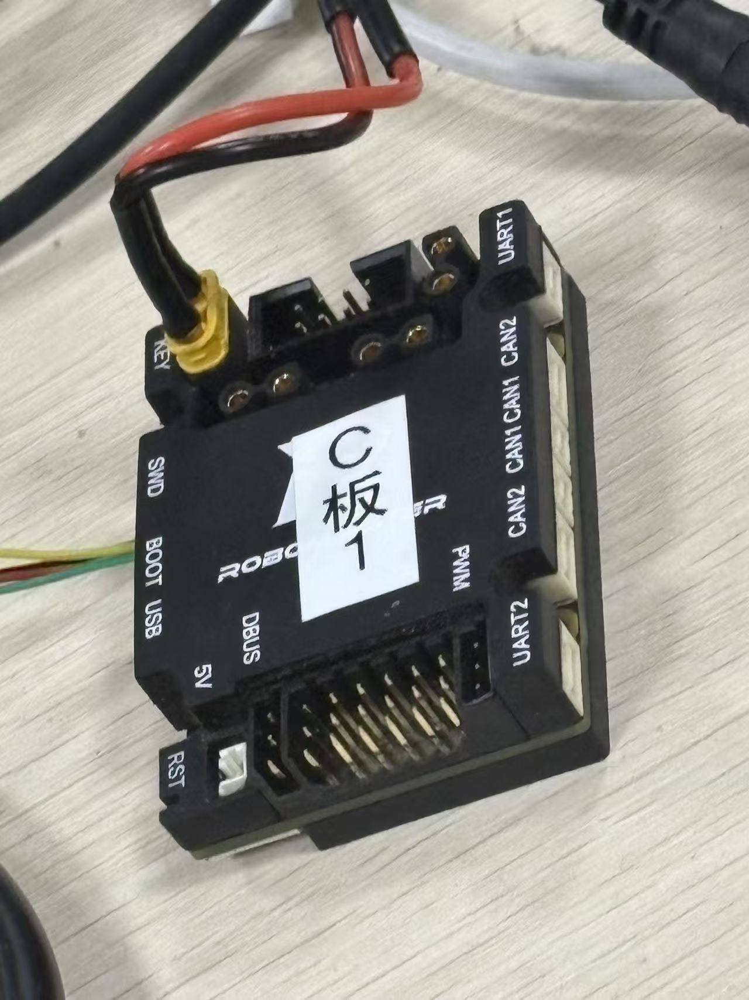
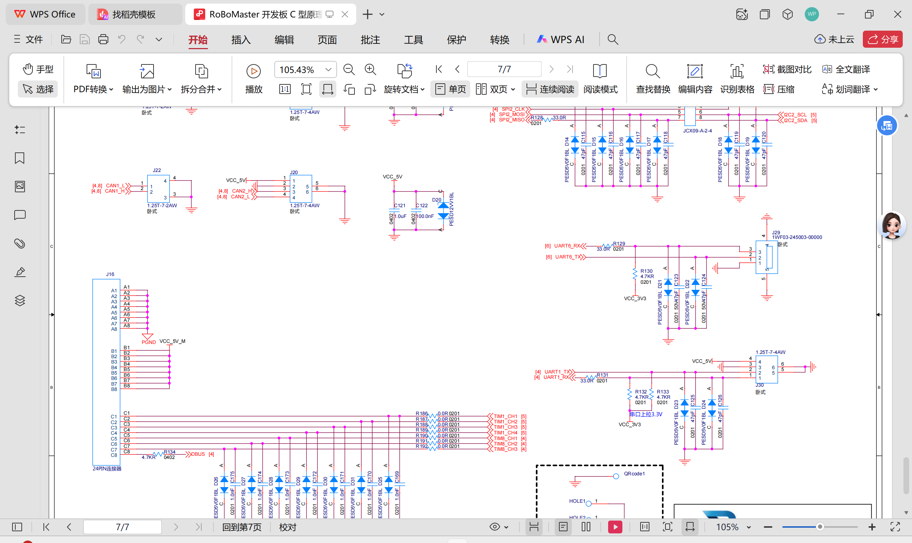

## 一、裁判系统概述
裁判系统是集成计算、通信、控制于一体的针对机器人比赛的电子判罚系统。

裁判系统整体包含：安装于机器人上的**机载端**，以及安装在PC物理机上的**服务器**和**客户端**软件。

**机载端**包含*主控模块*、*装甲模块*、*测速模块*、*场地交互模块*、*相机图传模块*、*定位模块*等，各模块组合成的系统可以感知机器人对抗过程中的伤害、发射弹丸的速度与频率、同时可以将机器人的第一视角画面传回客户端等。

**服务器和客户端软件**可以实时查看所有机器人的实时状态，根据比赛规则自动判定比赛胜负，同时可以通过服务器和客户端软件向机器人发送控制指令完成相应的操作。
##### 总览图

# 硬件
## 二、RoboMaster电源管理模块
RoboMaster电源管理模块可为机器人的底盘、云台、发射机构分别提供*3个通道24V的直流电源输出*，监测这3个通道的电流、电压并计算功率，然后根据服务器下发的控制指令执行电源输出*通断控制操作*。

同时，除了为这三路通道提供供电和检测功能外，电源管理模块还可提供5V、12V、24V直流电源*供其他裁判系统模块*使用。电源管理模块具有*通信转发*功能，可将各模块发送的数据包按照要求转发至目标模块。裁判系统相关信息将可通过电源管理模块的用户串口（User接口）输出。

## 三、装甲模块
RoboMaster 装甲模块属于机器人裁判系统的伤害感知部分，可安装于机器人周围外侧，用于检测机器人被弹丸攻击及
碰撞的情况。

装甲模块需要使用装甲支撑架进行安装。

装甲模块中触点连接器需要与装甲支撑架（需另购）连接，为装甲模块供电并实现装甲模块与主控模块之间的通信。 

## 四、RoboMaster 测速模块
RoboMaster 测速模块内置传感器，可实时测量枪管处所经过的弹丸速度及频率。其CAN接口（即航空线接头）
根据裁判系统通信协议，将获取的弹丸的射速和射频数据实时发送给裁判系统主控模块。当测速模块检测到弹丸经
过时，LED灯将会点亮进行提示，增加比赛的趣味性。 

## 五、相机图传模块 Video Transmission Module

RoboMaster相机图传模块是一套实时高清图像采集和无线传输系统，具有高清晰度、高帧率、低延迟的特点，并且支持多套相机图传模块同时工作。

#### 相机图传模块（接收端） VTM (Receiver) VT13
 RoboMaster相机图传模块接收端无需安装，可连接至电脑，具有数据传输、图像输出等功能，搭配RoboMaster赛事引擎选手端可以实现画面显示功能。

 同时，接收端可作为遥控器发送遥控数据，与发送端一一对应传输遥控数据。
 
  RoboMaster相机图传模块是RoboMaster高校系列赛裁判系统的组成部分，可以为用户提供机器人的第一人称视角。图传模块不可独立使用。
  
    
      
还有对频连接和固件升级操作。
#### 发送端
## 六、定位模块
定位模块与场地基站进行通信实现定位，为比赛地理围栏提供依据，**定位数据作为比赛客户端小地图的数据来源**，同时通过裁判系统电源管理模块的“用户接口”输出，供参赛队使用，比赛版本和销售版本接口和数据格式不同。
## 七、场地交互模块
场地交互模块是一款集读写IC卡、CAN通信、多状态指示灯于一体的模块。采用了13.56MHz的低频信号，支持读写ISO15693国际标准协议的IC卡，有效探测距离可以达到100mm(±5%)。配合RoboMaster裁判系统主控模块和电源管理模块使用，可实现IC卡的写入与读取操作。
## 八、RoboMaster裁判系统灯条模块
RoboMaster裁判系统灯条模块是显示机器人当前血量和状态的单元。通过观察灯条效果，用户可直观判断机器人当前剩余血量以及所处的状态。
## 九、RoboMaster 裁判系统超级电容管理模块 CM01
RoboMaster 裁判系统超级电容管理模块 CM01 是用于监测超级电容模组状态的单元。电容管理模块搭配 RoboMaster 裁判系统主控模块和电源管理模块使用，可检测超级电容模组的容值，实时监控其电压和容量。
## 十、RoboMaster 裁判系统装场地交互卡
RoboMaster 裁判系统装场地交互卡是符合ISO15693国际标准协议的IC卡，配合裁判系统场地交互模块，可以实现该IC卡的写入与读取操作。
## 十一、主控模块
裁判系统主控模块是裁判系统的核心控制单元，可以监控整个系统的运行状态，集成人机交互，无线通信，状态显示等功能。
# 软件

【注意】

C板上的UART1实际对应着UART6;

C板上的UART2实际对应着UART1。

看看C板原理图
