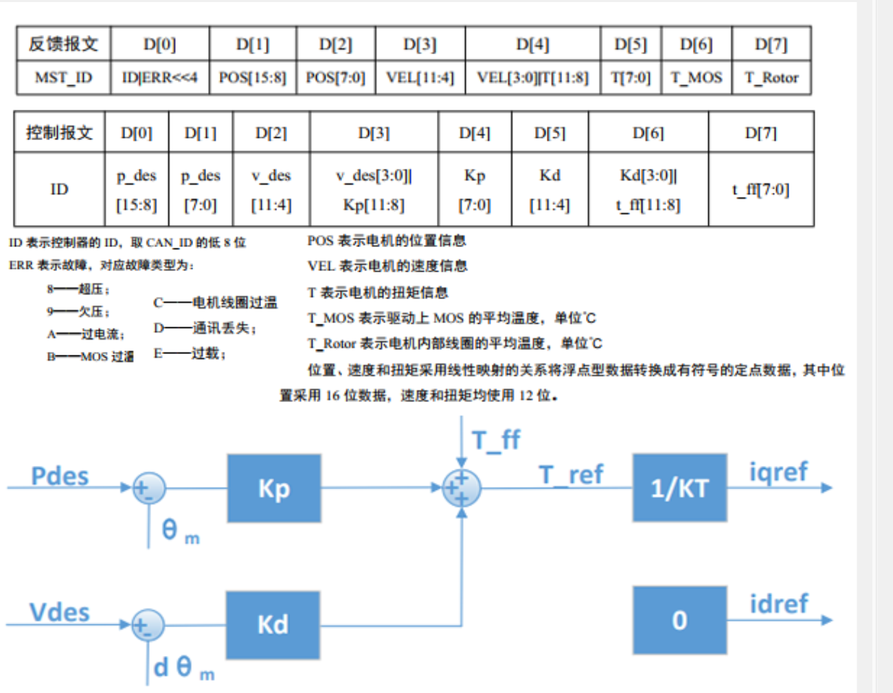
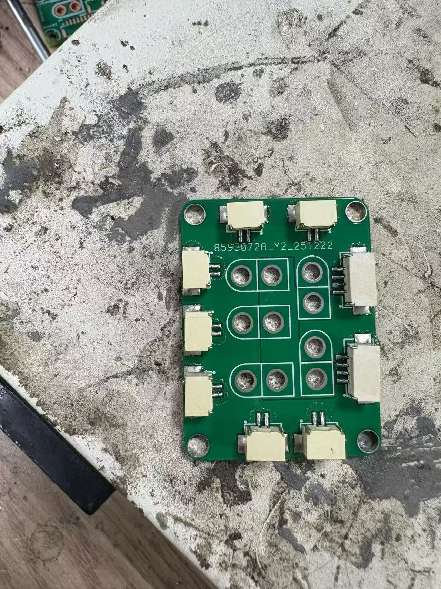

# Background information
#### 1.DM 电机有基于串口（UART）物理层的通信接口，但不是直接可用的 TTL 串口，而是差分串行通信（RS485/DRCAN）；
#### 2.需通过专用转接模块（CAN 转串口），才能将 DM 电机的通信信号转换成电脑可识别的普通串口信号；
#### 3.通信协议为大疆自定义，需用 DM 调试工具（而非通用串口助手）进行调试 / 控制。
## 简介
#### 达妙调试上位机是专为DM系列电机设计的PC应用程序，可以对电机进行读写参数、读取版本、固件升级、电机调试等操作，直观地配置驱动器参数。
## key协议

###### 这张图展示了DM 电机的通信报文格式（反馈 + 控制） 和电机的控制算法框图，是 DM 电机与控制器之间的核心交互规则和控制逻辑

#### 一、反馈报文（电机→控制器）

##### 反馈报文是电机向控制器上传自身状态的 8 字节数据帧，每个字节（D [0]-D [7]）对应不同的状态信息：反馈ID、ERR故障、POS电机位置、VEL电机速度、T电机扭矩、两温度。
[注意]
- D[0]
- 低 4 位：控制器 ID（匹配控制报文的 ID）【实际上只占4位】
- 高 4 位：故障码 ERR（左移 4 位）
#### 二、控制报文（控制器→电机）
##### 控制报文是控制器向电机下发指令的 8 字节数据帧，用于设置电机的目标状态和控制参数：
#### 三、故障码（ERR）说明
##### 图中已有较明确的解释
#### 四、控制算法框图（位置 - 速度双环 PID + 扭矩前馈）
##### 框图是 DM 电机的核心控制逻辑（永磁同步电机常用的id=0控制策略）：
###### 位置环：
###### 输入：期望位置Pdes、实际位置θm；
###### 计算：位置偏差（Pdes - θm）经过位置环比例增益Kp，得到位置环输出。
###### 速度环：
###### 输入：期望速度Vdes、实际速度dθm/dt（实际角速度）；
###### 计算：速度偏差（Vdes - dθm/dt）经过速度环增益Kd，得到速度环输出。
###### 前馈扭矩：
###### 输入：前馈扭矩T_ff（提前补偿负载扭矩，提升响应速度）。
###### 总参考扭矩：
###### 位置环输出 + 速度环输出 + 前馈扭矩T_ff = 参考扭矩T_ref。
###### 电流转换：
###### 参考扭矩T_ref除以转矩常数KT，得到 q 轴参考电流iqref（控制电机输出扭矩）；
###### d 轴参考电流idref=0（永磁同步电机的id=0策略：让 d 轴电流为 0，最大化转矩 - 电流比）。

## Q&A环节
### 🧐Q1：为什么DM电机有两个ID？

### A1：DM 电机的两个 ID（Master ID 和 Slave ID）是 CAN 总线通信中 “指令发送” 和 “状态反馈” 的功能区分。
###### 具体作用是：
###### Slave ID（从机 ID）是上位机给电机发送控制指令的 ID，相当于电机的 “接收地址”。比如图中的0x02，上位机向这个 ID 发送指令（如转速、位置），电机接收后执行。
###### Master ID（主机 ID）是电机向总线反馈自身状态的 ID，相当于电机的 “发送地址”。比如图中的0x12，电机运行时会通过这个 ID 向上位机回传数据（如当前速度、温度）。
##### 这样设计的核心原因是：
###### 避免通信冲突：指令和反馈用不同 ID，能同时处理 “发指令” 和 “收状态”，提升通信效率；
###### 多设备区分：多台电机同时工作时，每台电机的 Slave ID 和 Master ID 都是唯一的，上位机可以精准控制 / 读取某台电机。

### 🧐Q2：CAN ID 是报文的核心标识（用于节点寻址）用通俗的话说一说？

### A2：
###### 可以把 CAN 总线想象成一个 “共享的广播频道”，而 CAN ID 就是这个频道里的“节目编号”
###### 总线上的所有设备（比如电机控制器、上位机）都是 “听广播的人”—— 当某个设备要发消息时，会给这条消息贴一个 “节目编号（CAN ID）”，然后把消息 “广播” 到总线上。
###### 所有设备都会收到这条消息，但只有 ** 预设了 “我要听这个节目编号”** 的设备，才会 “接住” 这条消息、处理它；其他设备就会自动忽略这条消息。
###### 比如：上位机要给 “2 号电机控制器” 发指令，就给消息贴 “CAN ID=2” 的标签；总线上的 1 号、3 号控制器收到后，发现不是自己的 “编号”，就不管；只有 2 号控制器会接收并执行这个指令。

### 🧐Q3：控制报文的 D [0] 是纯 8 位 ID（直接填电机编号，比如 0x03 代表 3 号电机）；反馈报文的 D [0] 是ID/ERR<<4（低 4 位是 ID，高 4 位是故障码，比如 0x38 代表 ID=8、故障码 = 3）；两者的 ID 数值必须完全一致（比如控制报文 ID=8，反馈报文低 4 位 ID 也 = 8），才算 “匹配成功”，控制器才能将 “指令” 和 “反馈” 对应到同一个电机上。但是两者位数都不同，ID怎么匹配?
### A3:表面看控制报文是 8 位 ID、反馈报文只有 4 位 ID 位，看似 “位数不同”，但实际是存储格式不同，而非 ID 本身的数值范围不同，匹配的核心是 “提取两者的有效 ID 位做对比”，而非直接对比整个字节。
###### 澄清核心误解：ID 的 “有效位数” 是 4 位，而非 8 位
###### DM 电机的 ID 设计有个前提：电机的实际 ID 范围是 0~15（4 位二进制，0000~1111），最多支持 16 个电机组网，完全能满足大部分工业场景（比如机器人关节、设备执行机构一般不会超过 16 个电机）。
###### 控制报文 D [0] 的 8 位：只是 “用 8 位字节存 4 位有效 ID”，高 4 位默认是 0（比如 ID=8，控制报文 D [0] 是0x08（二进制0000 1000），而非0x80）；
###### 反馈报文 D [0] 的 8 位：拆分为 “高 4 位故障码 + 低 4 位 ID”，刚好把 4 位 ID 放在低 4 位，和控制报文的 “有效 ID 位” 完全对应。
### 🧐Q4：达妙电机MIT模式是不是相当于dji3508速度环，位置速度模式是不是相当于dji3508角度环？
###### A4：部分对应，但并非完全等同—— 达妙电机的 MIT 模式是 “混合控制框架”，可兼容速度 / 位置 / 扭矩控制；而 DJI 3508 的速度环、角度环是 “独立单一控制模式”，具体对应关系与差异如下：
##### 一、达妙 MIT 模式与 DJI 3508 速度环的对应关系
###### 达妙电机的MIT 模式是混合控制模式（可通过参数配置实现不同控制类型），当配置为 “位置增益 KP=0、速度增益 KD≠0”时，MIT 模式会退化为纯速度控制 ：电机接收目标速度指令，通过内部速度环维持该转速 —— 这一功能与 DJI 3508 的 “速度环”（单独的速度控制模式，输入目标速度后电机稳定转速）是对应的。
###### 但需注意：MIT 模式本身是 “位置 + 速度 + 扭矩” 的混合框架，并非专门的速度环；而 DJI 3508 的速度环是独立的单一控制模式。
##### 二、达妙 “位置速度模式” 与 DJI 3508 角度环的对应关系
###### 你提到的 “位置速度模式”，实际达妙电机的位置控制通常也集成在 MIT 模式中：当 MIT 模式配置为 **“位置增益 KP≠0、速度增益 KD≠0”时，会进入纯位置（角度）控制 **：电机接收目标角度指令，通过位置环 + 速度环的双环控制定位到目标角度 —— 这一功能与 DJI 3508 的 “角度环”（单独的位置控制模式，输入目标角度后电机精准定位）是对应的。

.png)
### Q5:必须用can通信吗，可不可以只连串口？

###### A5：这样可以收到一定信息，但是无法驱动达妙电机，必须用can。
## 收获
#### 1.这周学会了用加热台焊接can的卧贴

#### 2.用上位机跑通了dm电机MIT模式，位置速度模式
#### 3.由于连线和官方不同，对于can接线和供电了解更多。
#### 4.卡槽策略有限自动机初步学习