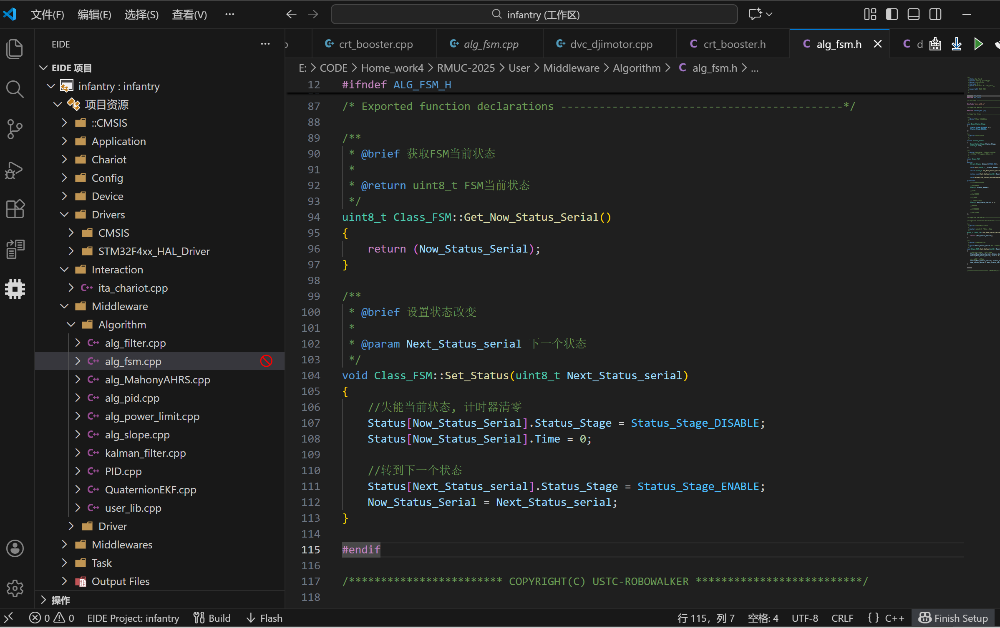

## 一.Init
```c
//裁判系统
        Referee.Init(&huart6);//这句好像要补
//发射机构
        Booster.Referee = &Referee;
        Booster.Init();
```
#### 1.1 先初始化裁判系统，再底盘模块关联裁判系统，
#### 【注意】Chassis.Referee：底盘模块中预留的一个 指针成员
```c
class Class_Booster
{
public:
    //热量检测有限自动机
    Class_FSM_Heat_Detect FSM_Heat_Detect;
    friend class Class_FSM_Heat_Detect;

    //卡弹策略有限自动机
    Class_FSM_Antijamming FSM_Antijamming;
    friend class Class_FSM_Antijamming;

    //裁判系统
    Class_Referee *Referee;

    //拨弹盘电机
    Class_DJI_Motor_C610 Motor_Driver;

    //摩擦轮
    Class_DJI_Motor_C620 Fric[4];
    //省略
}
```
#### 【作用】让底盘模块 “持有” 裁判系统的引用 —— 这样底盘不用重新创建 / 初始化裁判系统，直接通过 Chassis.Referee 就能访问裁判系统的数据或功能。
1.2 发射机构四模块初始化
```c
void Class_Booster::Init()
{
    //正常状态, 发射嫌疑状态, 发射完成状态, 停机状态
    FSM_Heat_Detect.Booster = this;
    FSM_Heat_Detect.Init(3, 3);

    //正常状态, 卡弹嫌疑状态, 卡弹反应状态, 卡弹处理状态
    FSM_Antijamming.Booster = this;
    FSM_Antijamming.Init(4, 0);

    //拨弹盘电机
    Motor_Driver.PID_Angle.Init(20.0f, 0.1f, 0.0f, 0.0f, 5.0f * PI, 5.0f * PI);
    Motor_Driver.PID_Omega.Init(3000.0f, 40.0f, 0.0f, 0.0f, Motor_Driver.Get_Output_Max(), Motor_Driver.Get_Output_Max());
    Motor_Driver.Init(&hcan1, DJI_Motor_ID_0x203, DJI_Motor_Control_Method_OMEGA);

    //摩擦轮电机左
    Fric[0].PID_Omega.Init(10.0f, 0.05f, 0.0f, 0.0f, 2000.0f, Fric[0].Get_Output_Max());
    Fric[0].Init(&hcan1, DJI_Motor_ID_0x201, DJI_Motor_Control_Method_OMEGA, 1.0f);
    Fric[1].PID_Omega.Init(10.0f, 0.05f, 0.0f, 0.0f, 2000.0f, Fric[1].Get_Output_Max());
    Fric[1].Init(&hcan1, DJI_Motor_ID_0x202, DJI_Motor_Control_Method_OMEGA, 1.0f);
    Fric[2].PID_Omega.Init(10.0f, 0.05f, 0.0f, 0.0f, 2000.0f, Fric[2].Get_Output_Max());
    Fric[2].Init(&hcan1, DJI_Motor_ID_0x203, DJI_Motor_Control_Method_OMEGA, 1.0f);
    Fric[3].PID_Omega.Init(10.0f, 0.05f, 0.0f, 0.0f, 2000.0f, Fric[3].Get_Output_Max());
    Fric[3].Init(&hcan1, DJI_Motor_ID_0x204, DJI_Motor_Control_Method_OMEGA, 1.0f);
    //摩擦轮电机右

    
}
```
## 二.alg_fsm.cpp文件学习
2.1Init具体在干嘛
```c
/**
 * @brief 状态机初始化
 *
 * @param __Status_Number 状态数量
 * @param __Now_Status_Serial 当前指定状态机初始编号
 */
void Class_FSM::Init(uint8_t __Status_Number, uint8_t __Now_Status_Serial)
{
    Status_Number = __Status_Number;

    Now_Status_Serial = __Now_Status_Serial;

    //所有状态全刷0
    for (int i = 0; i < Status_Number; i++)
    {
        Status[i].Status_Stage = Status_Stage_DISABLE;
        Status[i].Time = 0;
    }

    //使能初始状态
    Status[__Now_Status_Serial].Status_Stage = Status_Stage_ENABLE;
}
```
这段 Init 函数的核心逻辑可归纳为 3 个关键点：

1.配置基础规则：保存状态机的总状态数和初始状态编号；

2.清空旧状态：遍历所有状态，重置为 “禁用 + 计时清零” 的干净状态；

3.激活初始态：仅启用指定的初始状态，为状态机运行提供唯一起点。

2.2定时器处理函数模板（具体内容需要自定义）
```c
/**
 * @brief 定时器处理函数
 * 这是一个模板, 使用时请根据不同处理情况在不同文件内重新定义
 *
 */
void Class_FSM::Reload_TIM_Status_PeriodElapsedCallback()
{
    Status[Now_Status_Serial].Time++;

    //自己接着编写状态转移函数
}
```
接下来看具体的自定义内容
```c
/**
 * @brief 卡弹策略有限自动机
 *
 */
void Class_FSM_Antijamming::Reload_TIM_Status_PeriodElapsedCallback()
{
    Status[Now_Status_Serial].Time++;

    //自己接着编写状态转移函数
    switch (Now_Status_Serial)
    {
        case (0):
        {
            //正常状态
            Booster->Output();

            if (abs(Booster->Motor_Driver.Get_Now_Torque()) >= Booster->Driver_Torque_Threshold)
            {
                //大扭矩->卡弹嫌疑状态
                Set_Status(1);
            }
        }
        break;
        case (1):
        {
            //卡弹嫌疑状态
            Booster->Output();

            if (Status[Now_Status_Serial].Time >= 100)
            {
                //长时间大扭矩->卡弹反应状态
                Set_Status(2);
            }
            else if (abs(Booster->Motor_Driver.Get_Now_Torque()) < Booster->Driver_Torque_Threshold)
            {
                //短时间大扭矩->正常状态
                Set_Status(0);
            }
        }
        break;
        case (2):
        {
            //卡弹反应状态->准备卡弹处理
            Booster->Motor_Driver.Set_DJI_Motor_Control_Method(DJI_Motor_Control_Method_ANGLE);
            Booster->Drvier_Angle = Booster->Motor_Driver.Get_Now_Radian() + PI / 12.0f;
            Booster->Motor_Driver.Set_Target_Radian(Booster->Drvier_Angle);
            Set_Status(3);
        }
        break;
        case (3):
        {
            //卡弹处理状态

            if (Status[Now_Status_Serial].Time >= 300)
            {
                //长时间回拨->正常状态
                Set_Status(0);
            }
        }
        break;
    }
}
```
函数执行时机：定时器每触发一次（如 1ms / 次），该函数自动调用一次
函数核心流程：
1. 状态持续时间更新
    Status[Now_Status_Serial].Time++;

作用：记录当前状态已经持续的 “定时器周期数”（若定时器周期 1ms，则 Time 单位为 ms）。

2. 状态机核心逻辑（switch-case）

😕状态 0：正常状态（Normal Status）
```c
case (0):
{
    // 行为：执行器正常输出（如电机正常上弹、推进）
    Booster->Output();

    // 转移条件：当前电机扭矩绝对值 ≥ 扭矩阈值（负载过大，疑似卡弹）
    if (abs(Booster->Motor_Driver.Get_Now_Torque()) >= Booster->Driver_Torque_Threshold)
    {
        Set_Status(1); // 切换到「卡弹嫌疑状态」
    }
}
break;
```
正常工作时持续输出，同时监控电机扭矩；一旦扭矩超阈值（卡弹会导致电机负载增大、扭矩升高），立即进入「卡弹嫌疑状态」。

🫤状态 1：卡弹嫌疑状态（疑似卡弹，待验证）
```c
case (1):
{
    //卡弹嫌疑状态
    Booster->Output();  // 继续保持正常输出，不立即停转

    // 条件1：嫌疑状态持续≥100个定时器周期（比如10ms/周期=1秒）→判定真卡弹
    if (Status[Now_Status_Serial].Time >= 100)
    {
        Set_Status(2);  // 切换到卡弹反应状态
    }
    // 条件2：扭矩回落至阈值以下→判定是瞬时负载，不是真卡弹
    else if (abs(Booster->Motor_Driver.Get_Now_Torque()) < Booster->Driver_Torque_Threshold)
    {
        Set_Status(0);  // 切回正常状态
    }
}
break;
```
“疑罪从无” 的验证逻辑 —— 短时间扭矩超标可能是瞬时负载，只有持续超阈值（100 周期）才判定真卡弹，避免误触发。

🙃状态 2：卡弹反应状态（确认卡弹，准备处理）
```c
case (2):
{
    //卡弹反应状态->准备卡弹处理
    // 1. 将电机控制方式切换为「角度控制」（原本可能是扭矩/速度控制）
    Booster->Motor_Driver.Set_DJI_Motor_Control_Method(DJI_Motor_Control_Method_ANGLE);
    // 2. 计算回拨目标角度：当前弧度 + π/12（即15°，小幅回拨以解除卡弹）
    Booster->Drvier_Angle = Booster->Motor_Driver.Get_Now_Radian() + PI / 12.0f;
    // 3. 设置电机的目标弧度（执行回拨）
    Booster->Motor_Driver.Set_Target_Radian(Booster->Drvier_Angle);
    // 4. 切换到卡弹处理状态，等待回拨完成
    Set_Status(3);
}
break;
```
不再维持正常输出，而是主动干预 —— 切换电机控制模式为角度控制，让电机回拨 15°，试图解除卡弹，然后进入「卡弹处理状态」等待完成。

🫠状态 3：卡弹处理状态（执行回拨，等待恢复）
```c
case (3):
{
    //卡弹处理状态
    // 卡弹处理（回拨）持续≥300个周期（比如3秒）→判定处理完成
    if (Status[Now_Status_Serial].Time >= 300)
    {
        // 切回正常状态，恢复正常工作
        Set_Status(0);
    }
}
break;
```
无额外控制逻辑，仅等待回拨动作持续 300 个周期（确保卡弹完全解除），然后切回正常状态。

2.3 Set_Status函数（inline）

这个 Set_Status 函数是有限状态机（FSM）的核心状态切换接口，**作用**是将状态机从「当前状态」干净地切换到「目标状态」—— 它会先失能当前状态并清零其计时器，再启用目标状态，最后更新当前状态序号，保证状态切换时无残留数据干扰。

```c
void Class_FSM::Set_Status(uint8_t Next_Status_serial)
{
    //失能当前状态, 计时器清零
    Status[Now_Status_Serial].Status_Stage = Status_Stage_DISABLE;
    Status[Now_Status_Serial].Time = 0;

    //转到下一个状态
    Status[Next_Status_serial].Status_Stage = Status_Stage_ENABLE;
    Now_Status_Serial = Next_Status_serial;
}
```
## 三、【Q&A】环节

### Q1：🧐 为什么有friend class Class_FSM_Antijamming？

```c
class Class_Booster
{
public:
    //热量检测有限自动机
    Class_FSM_Heat_Detect FSM_Heat_Detect;
    friend class Class_FSM_Heat_Detect;

    //卡弹策略有限自动机
    Class_FSM_Antijamming FSM_Antijamming;
    friend class Class_FSM_Antijamming;

    //裁判系统
    Class_Referee *Referee;

    //拨弹盘电机
    Class_DJI_Motor_C610 Motor_Driver;

    //摩擦轮
    Class_DJI_Motor_C620 Fric[4];
    //omit
}
```
#### A1：😎这两行 C++ 代码是 “卡弹策略有限自动机” 与当前类的 实例定义 和 友元授权。
###### friend class X：C++ 的友元机制，作用是让类 X 能 突破封装限制，直接访问当前类的所有成员（包括 private/protected 私有 / 保护成员，无需通过 public 接口）。
###### 这里的含义：当前类允许 Class_FSM_Antijamming 类（卡弹状态机类）访问自己的所有成员。
###### 友元声明写在哪个类的定义内部，这个类就是 “当前类”。
##### 如果没有友元授权，状态机类无法直接访问这些私有成员，只能通过当前类提供的 public 接口（比如 GetJamStatus()、SetReleaseAttempts()）间接操作 —— 但卡弹处理需要高频、高效的状态交互，友元机制能简化逻辑、提升效率（避免冗余接口）。
#### 【补充】
##### 友元是 单向的：当前类允许状态机类访问自己，但状态机类不一定允许当前类访问它的私有成员（除非状态机类也声明当前类为友元）；

##### 友元会 “破坏封装”，因此仅用于 关系极度密切、需要深度协同 的类之间（比如这里的 “设备控制器” 和 “专属卡弹策略机”），是 “必要的耦合”；

### Q2:🧐为什么发射机构模块初始化的时候有FSM_Antijamming.Booster = this;
```c
 //正常状态, 卡弹嫌疑状态, 卡弹反应状态, 卡弹处理状态
    FSM_Antijamming.Booster = this;
    FSM_Antijamming.Init(4, 0);
``` 
#### A2：😎
### this：C++ 关键字，代表 当前类的实例对象的地址（可以理解为 “当前类自己” 的指针）；
#### 核心用途：让状态机 “记住” 当前设备，实现双向访问
#### 之前通过 friend 授权，状态机类能访问当前类的私有成员；但反过来，状态机在处理卡弹逻辑时（比如执行解除卡弹、更新状态），需要主动 “找到” 当前设备的*实例*，才能操作它的成员（比如读取传感器、控制硬件）。

```c
class Class_FSM_Antijamming : public Class_FSM
{
public:
    Class_Booster *Booster;

    void Reload_TIM_Status_PeriodElapsedCallback();
};
```
#### 注意一下这个

     Class_Booster *Booster;

#### 你把 this 赋值给状态机的 Booster 成员，本质是让状态机 “持有” 这个实例的指针 —— 后续状态机处理卡弹逻辑时，就能通过这个指针找到对应的 Class_Booster 实例，进而操作它的成员。

#### 只要你定义一个 Class_Booster 的实例，并且让这个实例调用 Init() 函数，状态机就能通过之前保存的 this 指针，找到这个实例—— 这是最核心、最直接的实现方式。
✌️✌️✌️【总结一下】
# Q1&Q2，实际上就是让Class_FSM_Heat_Detect可以完全访问Class_Booster实例里面的东西，通过指针
### Q3:为什么函数定义直接写在.h文件上了呢

#### A3:这是特殊的inline函数
### 正常来说，定义不可以放在.h文件里头，但是他不正常，他是内联函数，被inline关键字修饰
### 内联函数会在编译的时候直接展开，不会创建函数栈，可以减少内存开销，但是👍前提是必须把定义和声明写在一个文件里，所以就有这个现象了。👍
### 那些没有被inline修饰的成员函数就需要在.cpp（源文件）里面定义了。