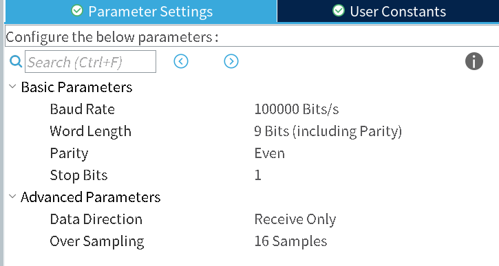
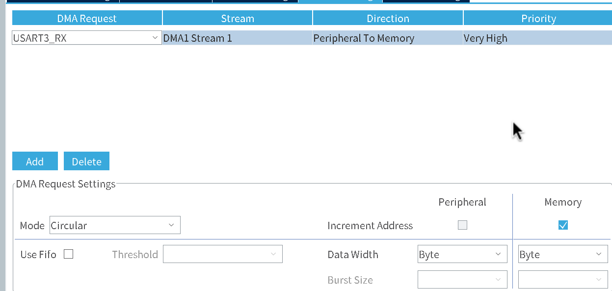
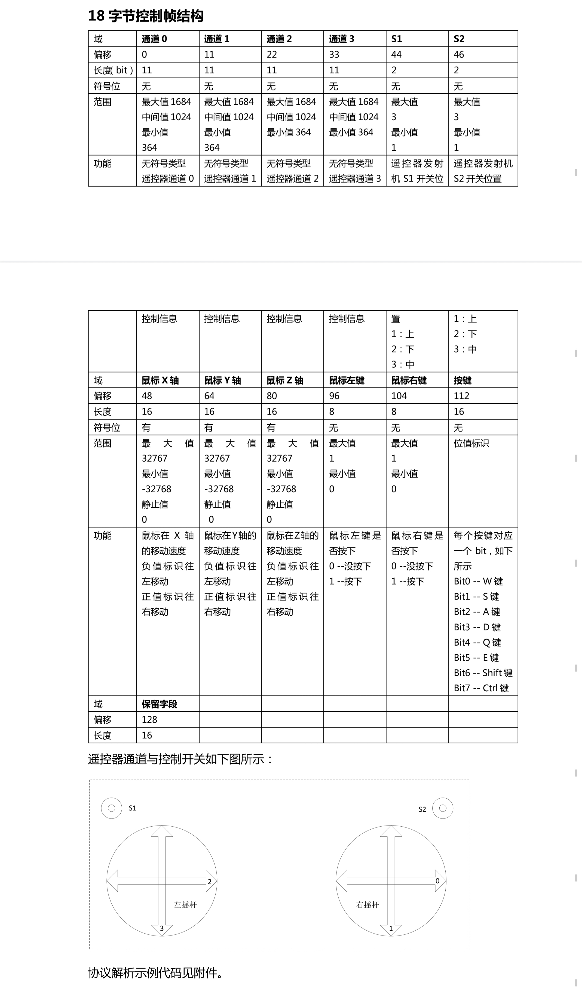
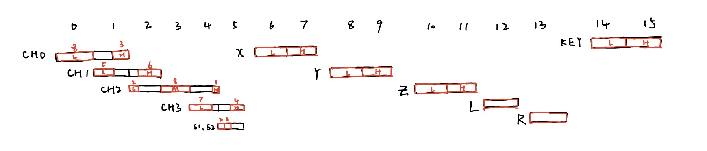
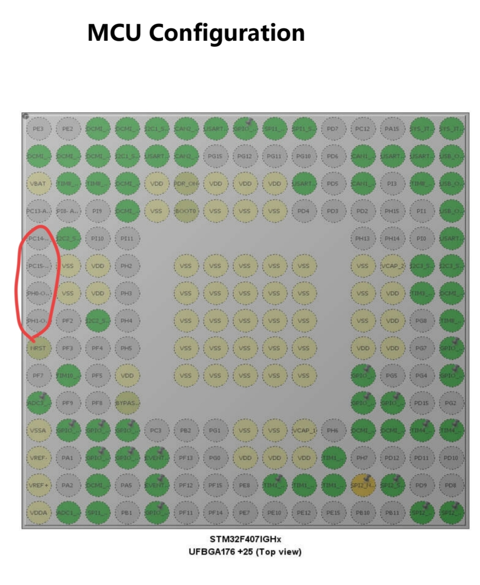

# DBUS 作业笔记

## DBUS 介绍

DBUS 其实就是 SBUS(Serial BUS)，在 RoboMaster 领域被大疆更名为了 DBUS。

SBUS 可以简单理解为跑在特殊模式下的串口。波特率为 100,000bps，8 位数据位+1 位偶校验位+1 位结束位。

同时，在硬件上，SBUS 数据的接受需要接一个反相器，这是由于 SBUS 的数据和正常的 TTL 数据相位是相反的。

## 串口的配置

### 外设配置

测试用的开发板是 Robomaster C 型开发板，SBUS 接口使用的是 USART3。由于我们需要一直不断的接受传来的数据，所以我们将 DMA 设置为循环模式。详细配置如下图所示。



### 代码初始化过程

启用中断并启动 DMA 接受数据。

```c
uint8_t dbus_rx_buffer[50];
uint8_t dbus_frame_data[18];

void DBUS_UART_Init(UART_HandleTypeDef *huart)
{
    __HAL_UART_CLEAR_IDLEFLAG(huart);
    __HAL_UART_ENABLE_IT(huart, UART_IT_IDLE);
    HAL_UART_Receive_DMA(huart, dbus_rx_buffer, sizeof(dbus_rx_buffer));
}
```

### 中断函数的处理

中断函数中，我们需要确保接收到的数据为 18 字节，并且由于 DMA 在持续不断的接受数据，也需要暂时禁用 DMA,在处理结束后再次启动，防止处理过程中原数据被覆盖，从而无法正确处理。

```c
void DBUS_UART_Handler(UART_HandleTypeDef *huart)
{
    __HAL_UART_CLEAR_IDLEFLAG(huart);
    __HAL_DMA_DISABLE(huart->hdmarx);

    uint16_t received_count = sizeof(dbus_rx_buffer) - __HAL_DMA_GET_COUNTER(huart->hdmarx);

    if (received_count == 18)
    {
        memcpy(dbus_frame_data, dbus_rx_buffer, 18);
        DBUS_DataHandler(dbus_frame_data);
    }

    __HAL_DMA_SET_COUNTER(huart->hdmarx, sizeof(dbus_rx_buffer));
    __HAL_DMA_ENABLE(huart->hdmarx);
}
```

在`void USART3_IRQHandler(void)`函数中，加入下面语句。

```c
DBUS_UART_Handler(&huart3);
```

## 数据帧的解析

DBUS 接受到的数据一帧共有 18 字节，涵盖了 4 个通道的遥感位置、开关位置、以及适配键鼠操作的三个方向上的鼠标移速、鼠标左右键和键盘上的 WASDQE+Shift+Ctrl 共 8 个键。详细说明如下表所示。



更直观的示意图如下。



可以发现似乎数据有点杂乱，一项数据被拆的东一块西一块的。但其实把数据字节反过来看，所有的数据便都连贯了。

具体的解析代码如下。

```c
typedef struct {
    struct {
        int16_t _0;
        int16_t _1;
        int16_t _2;
        int16_t _3;
    } Channel;
    struct {
        uint8_t _1;
        uint8_t _2;
    } Switch;
    struct {
        struct {
            int16_t x;
            int16_t y;
            int16_t z;
        } Axis;
        struct {
            uint8_t Left;
            uint8_t Right;
            uint16_t Keys;
        } Key;
    } Mouse;
} DBUS_Control_Typedef;

void DBUS_DataHandler(uint8_t *data)
{
    DBUS_Control.Channel._0 = ((int16_t)data[0] | ((int16_t)data[1] << 8)) & 0x07FF;
    DBUS_Control.Channel._1 = (((int16_t)data[1] >> 3) | ((int16_t)data[2] << 5)) & 0x07FF;
    DBUS_Control.Channel._2 = (((int16_t)data[2] >> 6) | ((int16_t)data[3] << 2) |
                               ((int16_t)data[4] << 10)) &
                              0x07FF;
    DBUS_Control.Channel._3 = (((int16_t)data[4] >> 1) | ((int16_t)data[5] << 7)) & 0x07FF;
    DBUS_Control.Switch._1 = ((data[5] >> 4) & 0x000C) >> 2;
    DBUS_Control.Switch._2 = ((data[5] >> 4) & 0x0003);
    DBUS_Control.Mouse.Axis.x = ((int16_t)data[6]) | ((int16_t)data[7] << 8);
    DBUS_Control.Mouse.Axis.y = ((int16_t)data[8]) | ((int16_t)data[9] << 8);
    DBUS_Control.Mouse.Axis.z = ((int16_t)data[10]) | ((int16_t)data[11] << 8);
    DBUS_Control.Mouse.Key.Left = data[12];
    DBUS_Control.Mouse.Key.Right = data[13];
    DBUS_Control.Mouse.Key.Keys = ((int16_t)data[14]); // | ((int16_t)data[15] << 8);
}
```

## 实际效果

[实际效果](./videos/15-30-05-12-2025.mp4)

## 开发过程中遇到的问题

开发过程中，出现了串口接受数据始终不正常的现象。表现为接受数据杂乱，长度不足。
同时在 HAL 库的`HAL_UART_IRQHandler`函数中，出现了`Frame Error`与`Noise Error`。
这明显是不正常的。经过长时间的多种尝试，最终发现问题不在串口或 DMA 的配置上，而在于时钟上。
将晶振切换为内部晶振，一切便恢复正常。

为了寻找这一现象出现的原因，我查阅了所使用的开发板的原理图，发现其并无外部晶振，也就是说，以外部晶振为基础的代码理所当然的会出现问题。

相关原理图如下。可见用于外部晶振的部分完全没有使用。


## 反思与总结

这次的任务涉及的领域为串口和 DBUS、以及 DMA 的使用。特别是积累了 DMA 循环模式的开发经验。
同时，开发时出现的问题，也警示了外设的配置一定要遵照原理图，不能想当然的认为板子上一定有某些外设，从而导致运行效果异常，以及调试困难。
