# CAN（CONTROLLER AREA NETWORK）
## 1.CAN总线是如何通讯的？
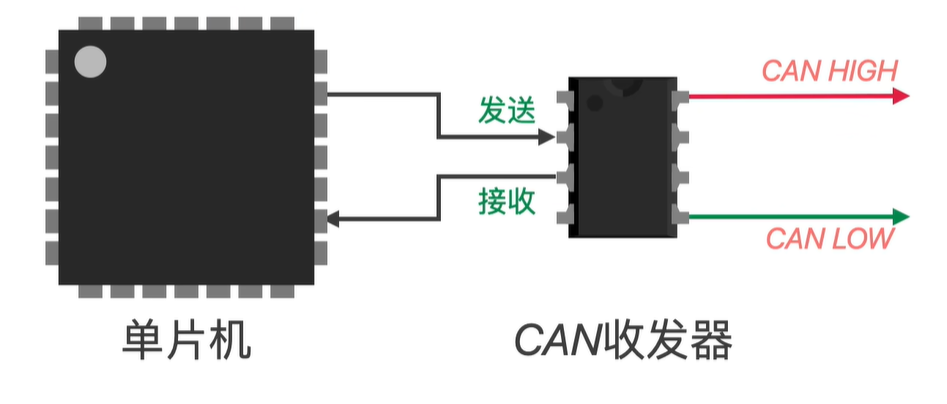
#### can通信需要专门的CAN收发器（can收发芯片）

#### 当单片机发送普通的逻辑0和逻辑1信号后，该普通信号经过can收发器之后会被转化为差分信号（差分线是用两根线表示一个信号）
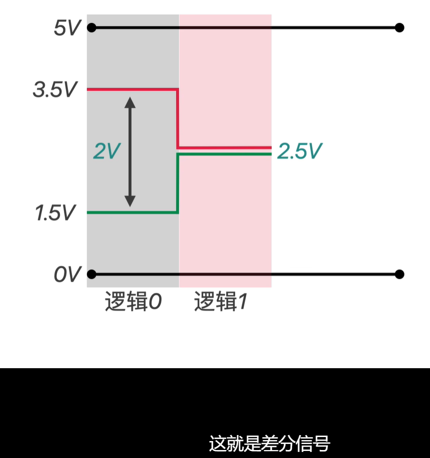
逻辑0代表低电平，逻辑1代表高电平

同样的，CAN收发器也可以把接收到的差分信号，转化为普通电平信号，然后再发给单片机。
### 采用差分信号的好处
只有一根线的普通信号，当某一点受到干扰，它的电平就会发生跳变，这样就会导致传输出错，不可长距离传输；而CAN通信采用的差分信号是两根线共同作用，而且是双绞线缠绕，这样的话，受到干扰也是一起的，压差不变，这样就能保证传递的信息不受干扰。
因此，can信号的传输距离可以达到1000m（低速）。
## 2.can通讯到底在传递什么？
#### 如下图，这是一帧标准的数据帧：
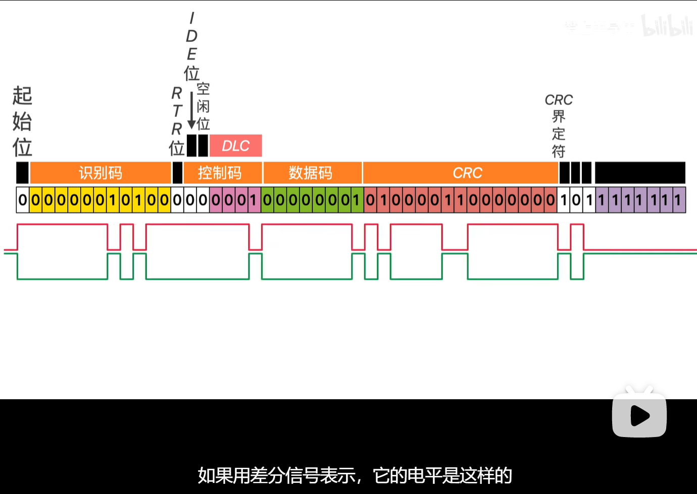
另，识别码可以代表优先级eg：当总线上有两个ECU时，总线上同时有0和1，会先选0。

###  通信相关的基础知识——物理信号
#### 1.分层思想
##### CAN通信可以简单地分为3层
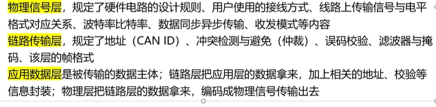
#### 2.接线方式
##### 每个设备引出CAN_H和CAN_L，H和H接，L和L接
##### 2个120欧电阻接在总线末端
#### 3.传播速率
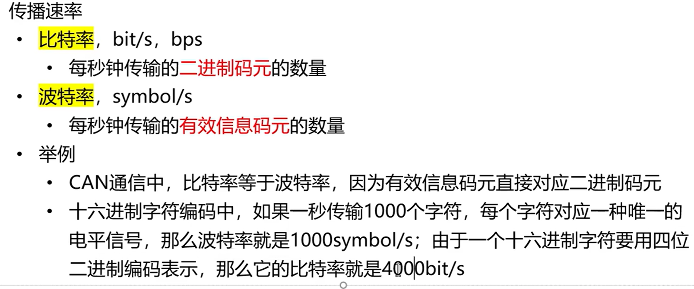
#### 4.异步通信
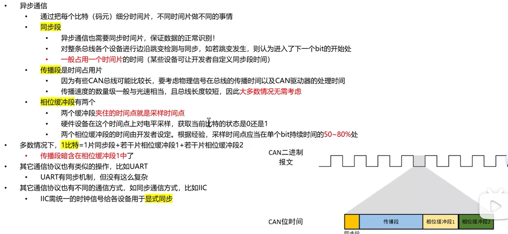
#### 5.线路上传输信号的电平模式
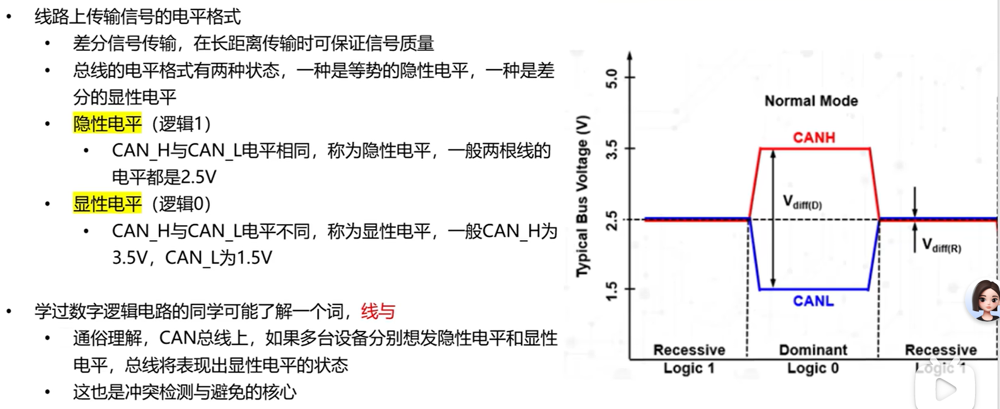
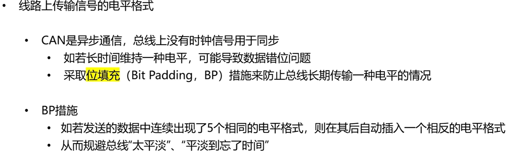
#### 6.收发模式
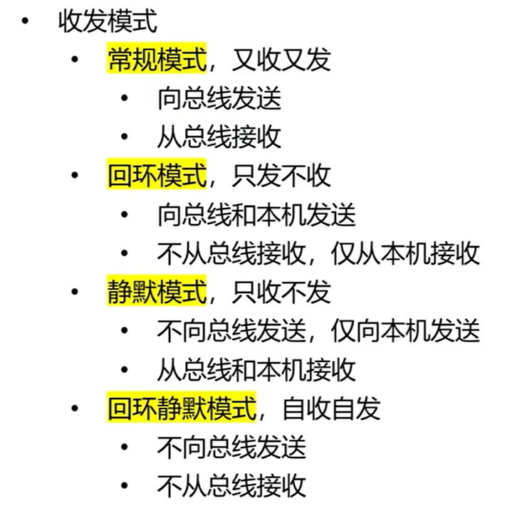
##### RM主要用第一种
###  通信相关的基础知识——链路传输
#### 1.CAN ID

#### 2.仲裁
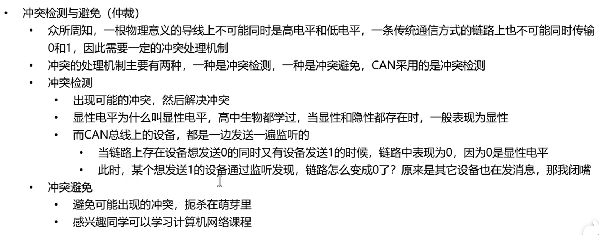
#### 3.误码校验
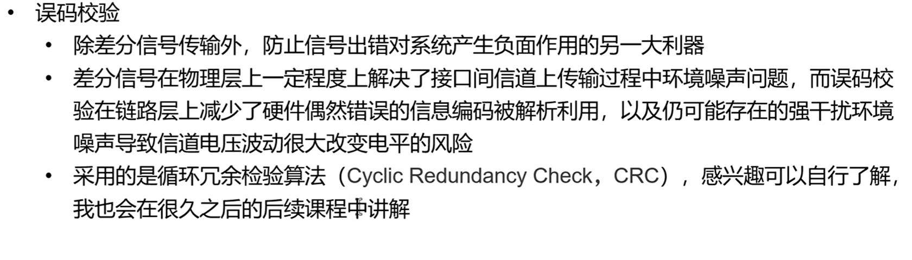
#### 4.can通信帧介绍
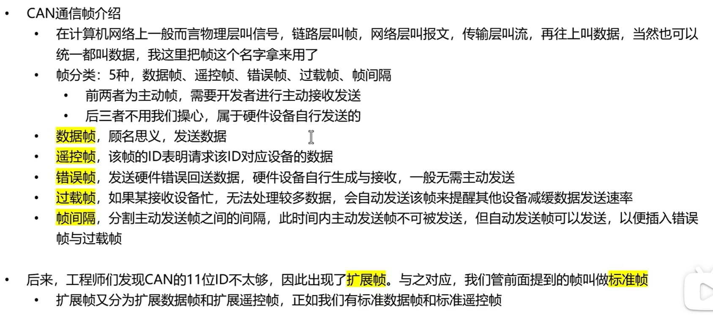
标准vs拓展
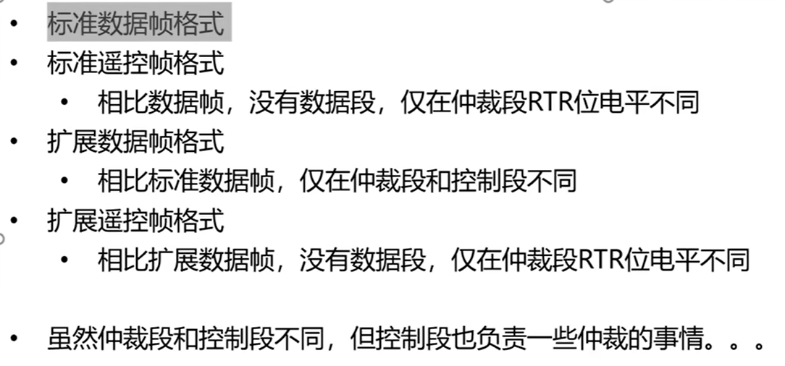
# 标准数据帧格式（重点）

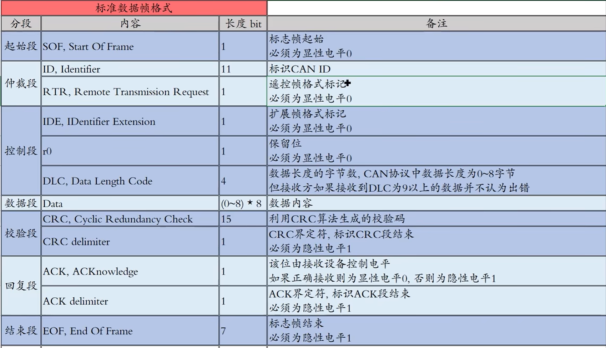
### 起始段：SOF
###### 平时总线空闲的时候CAN_H和CAN_L都是2.5V，为隐性电平1；当某个设备要发东西，他就会把总线拉起，呈现显性电平，这样，别的设备就知道有的设备要发送消息了。
### 仲裁段：CAN ID＋RTR位
###### RTR位是遥控帧的格式标记。如果我们发的是数据帧的话，RTR为显性电平0。那么这意味着什么？
##### 有以下两点：
###### 1.canID 0靠前的0多的在仲裁过程中留下来
**即 ID 越小，发送的优先级越高。**

###### 2.数据帧的优先级高于遥控帧
### 控制段：IDE+r0+DLC
###### IDE：如果我们发的是标准帧的话，IDE必须为显性电平0。这意味着标准帧的优先级高于拓展帧；
###### r0:保留位无意义，但必须为0；
###### DLC：数据长度的字节数
### 数据段：Data
###### 存放数据主要内容
### 校验段：CRC和CRC界定符
###### 选用CRC15；CRC界定符它标志着CRC段结束，必须为隐性电平1；
🧐🧐CRC实际上是通过硬件自行实现的，不需要我们自己写CRC的校验代码。？？？（类似UART的奇校验和偶校验不需要自己写校验位）
###### 校验段束后结意味着整个数据已经发送出去了（该发的都发了）
### 回复段：
###### 由接收设备控制电平，正确接收就显性电平0，不正确1；
##### 如果多个设备同时接收，只要有一个接收成功那么就是0，那么如果有不接收成功的，那么就是你自己的问题喽。
### 结束段：隐形电平1标志结束了。
# 标准遥控帧格式
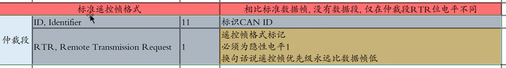
相比数据帧，没有数据段，仅在控制端RTR位电平不同
# 拓展数据帧格式
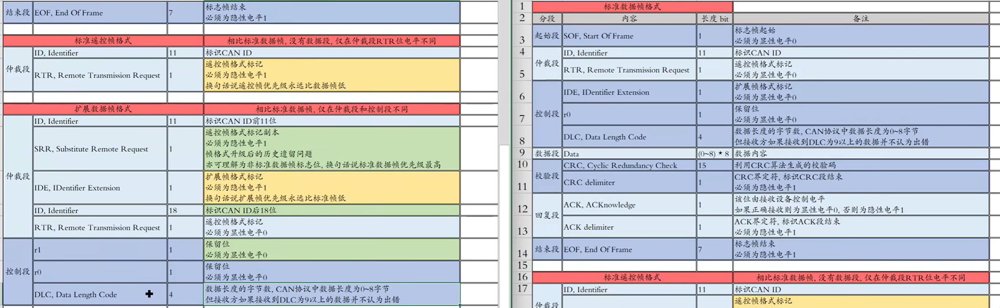
对比着看吧，想想为什么标准数据帧的控制段的东西在该处的仲裁段？（因为仲裁未结束）
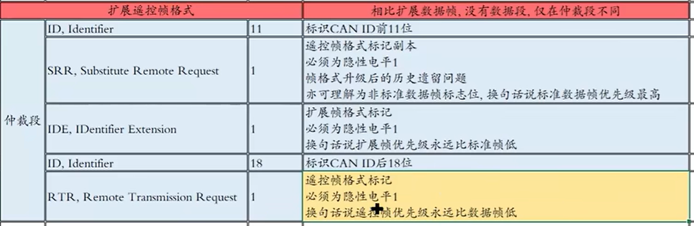
# 5.滤波器与掩码（重要）