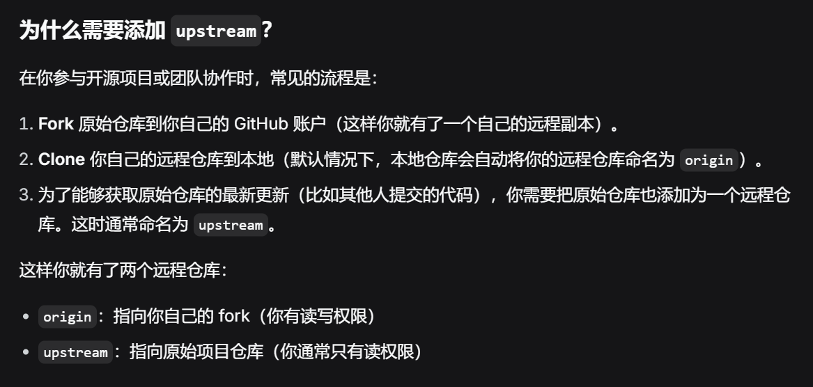
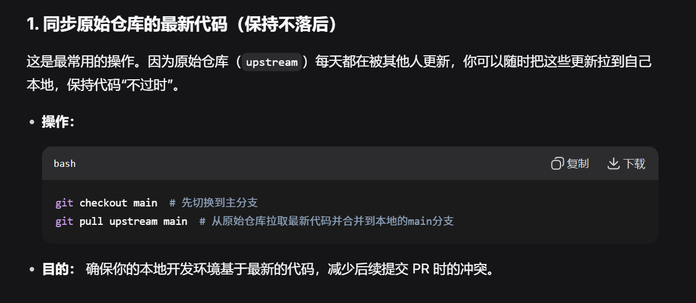
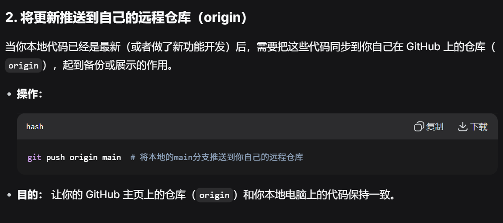
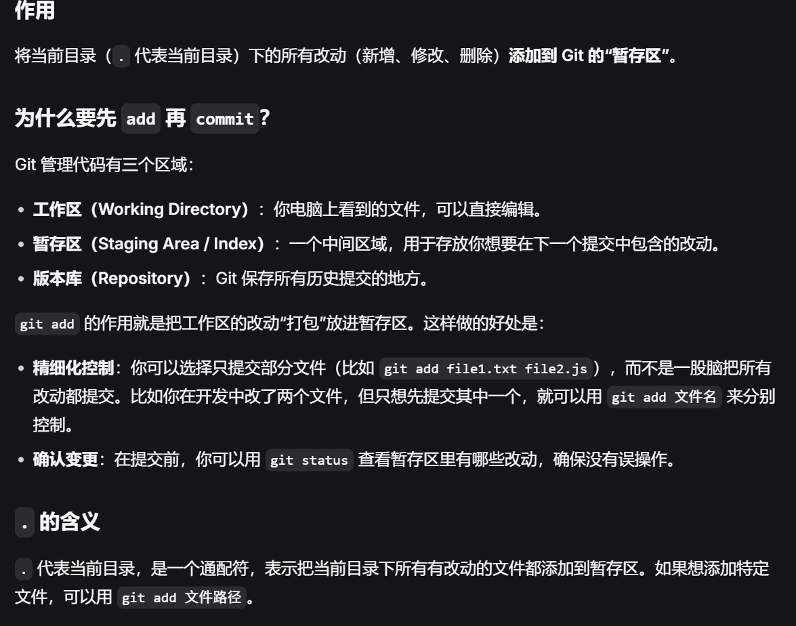
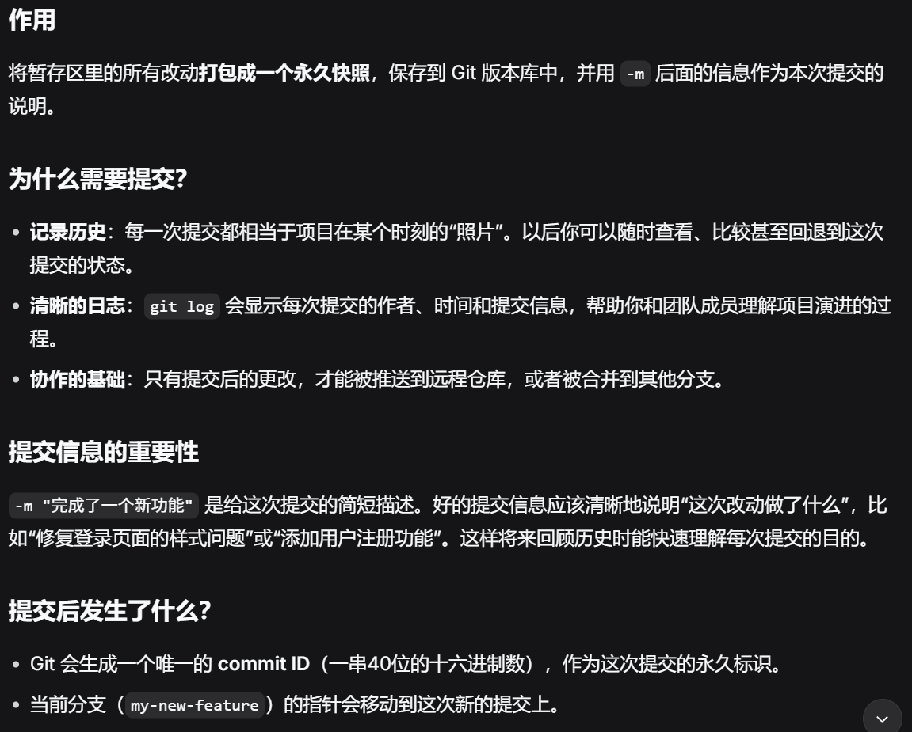
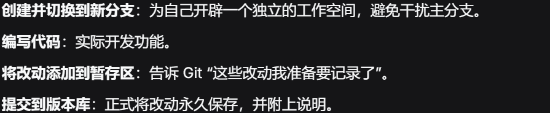

 
 ###### 本地仓库的分支是从远程仓库拉取下来的副本。当克隆一个仓库时，会自动创建本地main分支，并与远程origin/main关联。也可能通过git fetch或git pull从upstream获取更新，但本地main分支始终是存在于本地的一个分支。
 ###### 默认情况下，只有默认分支会被自动创建为本地分支。远程仓库通常有多个分支，比如 main、dev、feature-xxx 等。当你克隆时，Git 会自动：把远程仓库的所有分支都下载下来，但只将远程的默认分支（通常是 main）创建为本地分支。其他远程分支（如 dev、feature-1）在本地只以“远程跟踪分支”的形式存在（例如 remotes/origin/dev），不会自动创建对应的本地分支。

### 接下来可以做的事：
第一，
 
 ##### 先切换到本地的 main 分支。然后从远程仓库 upstream 拉取其 main 分支的最新提交，并将这些更新合并到你当前所在的本地 main 分支中。
 第二，

第三......

（想干嘛自己根据需要决定）

图中的

git add .有啥用

git commit -m "xxxxxx"有啥用

##### 第三的总结：
