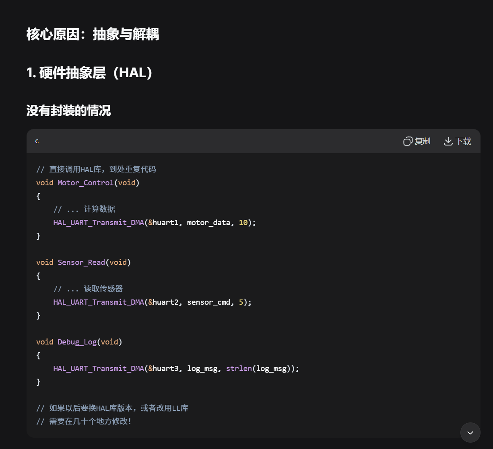
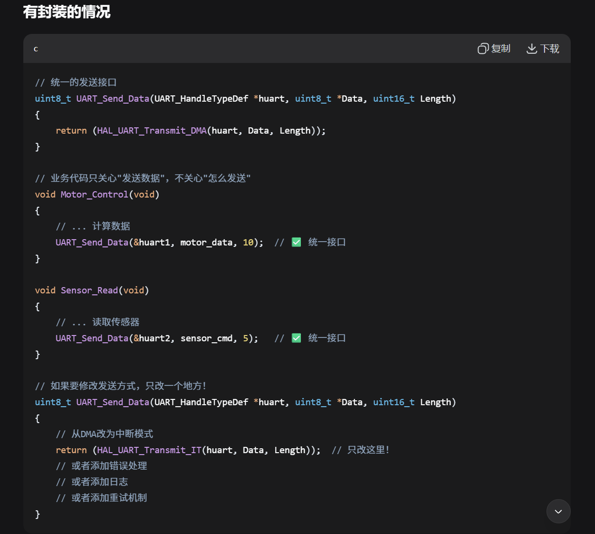
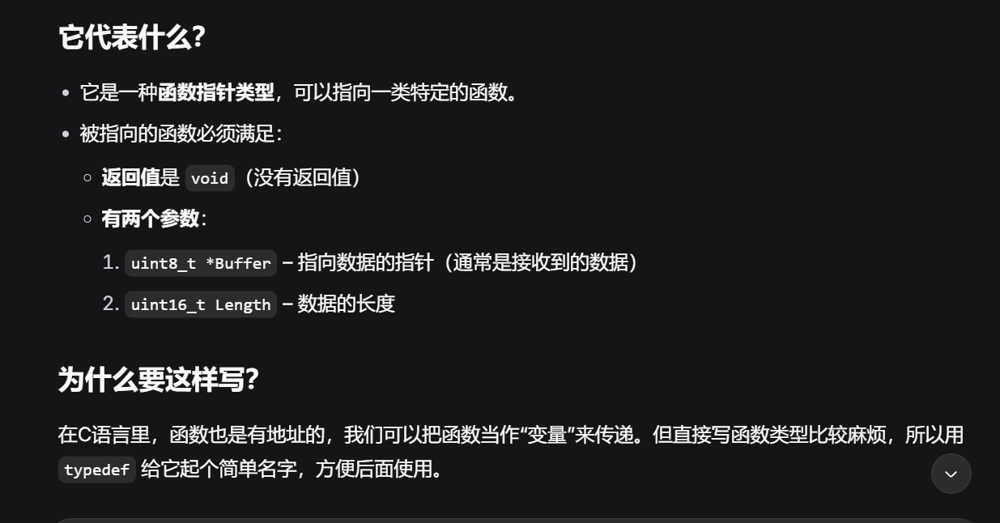
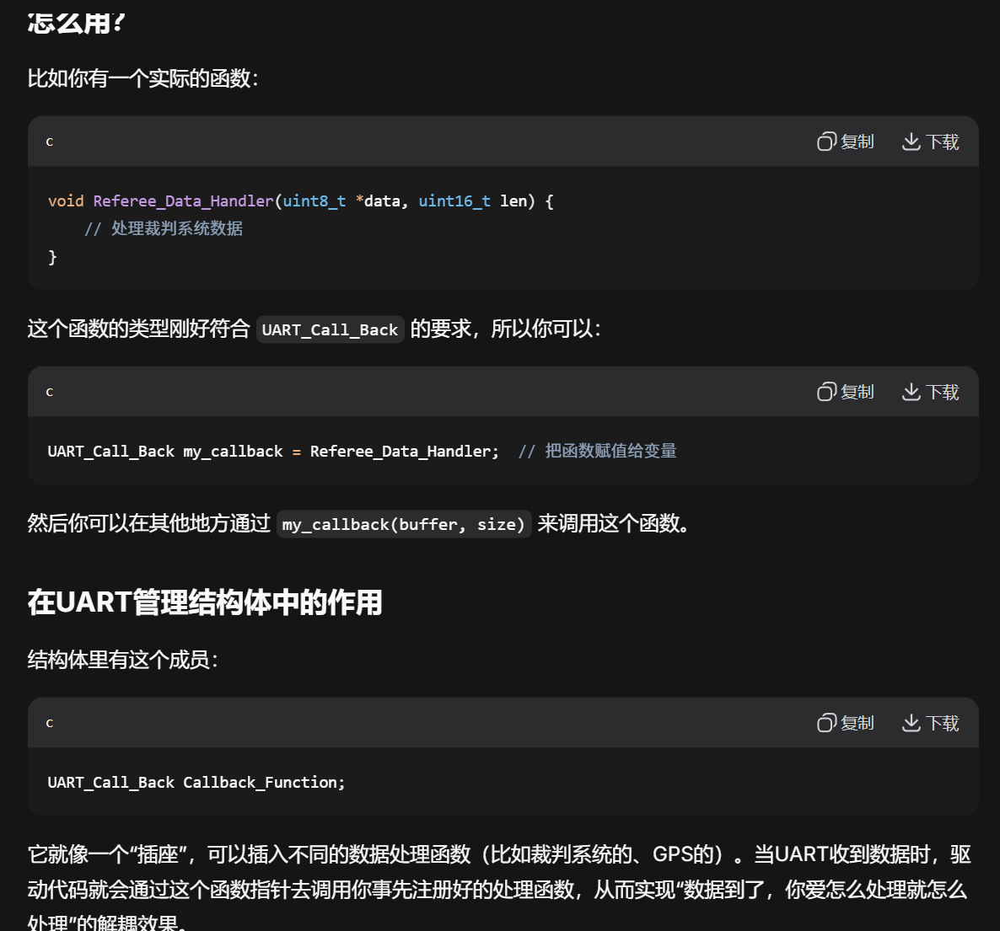
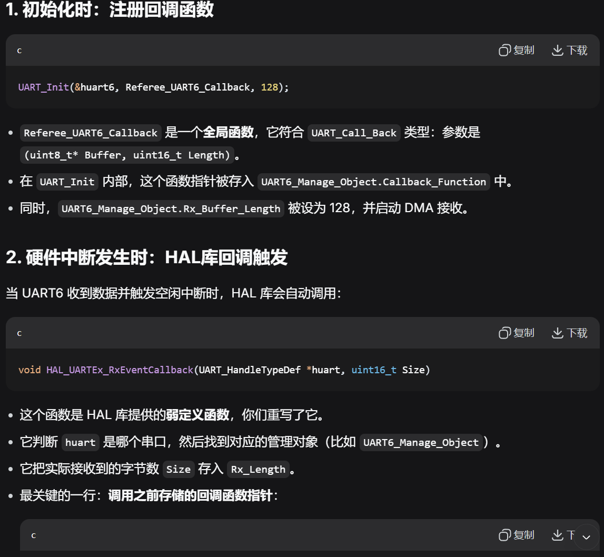
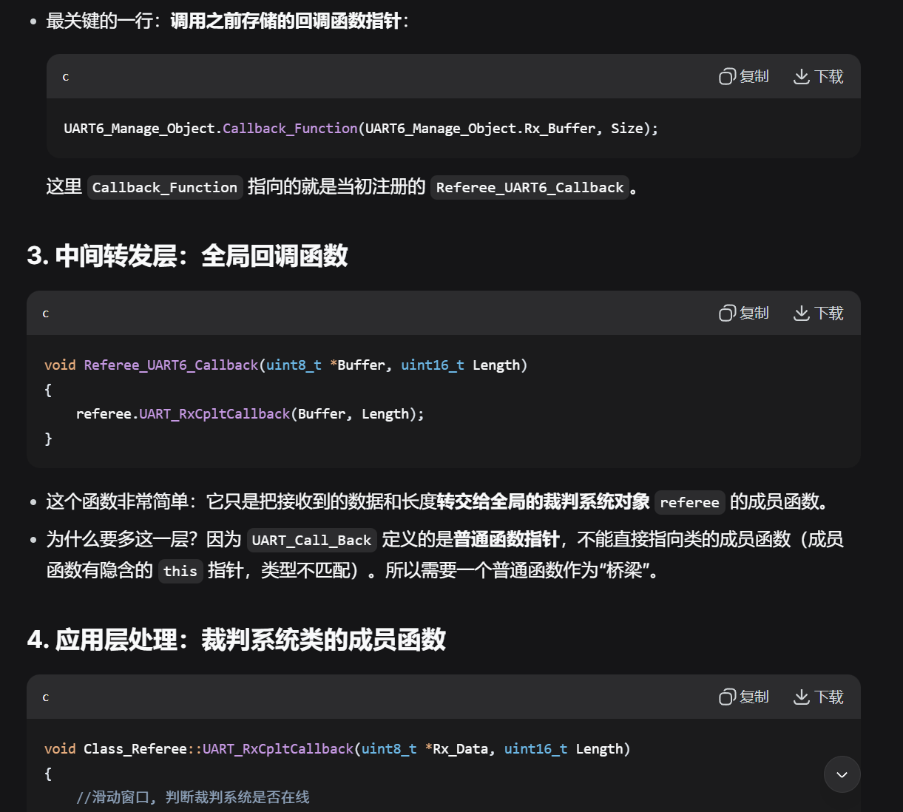
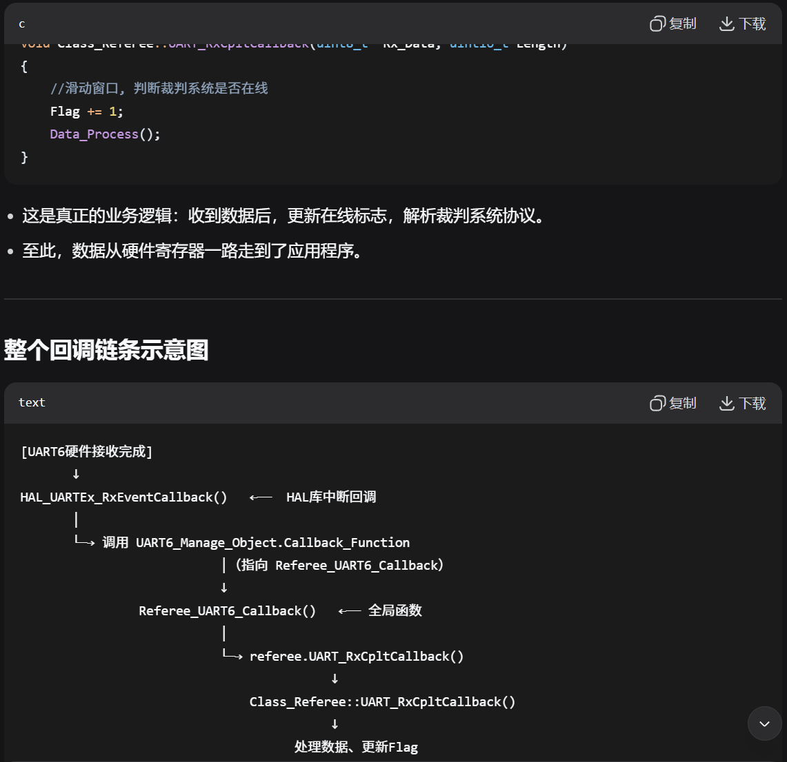

```c
/**
 * @brief 裁判系统初始化
 *
 * @param __huart 指定的UART
 * @param __Frame_Header 数据包头标
 */
void Class_Referee::Init(UART_HandleTypeDef *huart, uint8_t __Frame_Header)
{
    if (huart->Instance == USART1)
    {
        UART_Manage_Object = &UART1_Manage_Object;
    }
    else if (huart->Instance == USART2)
    {
        UART_Manage_Object = &UART2_Manage_Object;
    }
    else if (huart->Instance == USART3)
    {
        UART_Manage_Object = &UART3_Manage_Object;
    }
    else if (huart->Instance == UART4)
    {
        UART_Manage_Object = &UART4_Manage_Object;
    }
    else if (huart->Instance == UART5)
    {
        UART_Manage_Object = &UART5_Manage_Object;
    }
    else if (huart->Instance == USART6)
    {
        UART_Manage_Object = &UART6_Manage_Object;
    }

    Frame_Header = __Frame_Header;
}
```
## 初始化：只要初始化1次，接下来的DMA开启全部放在了回调里面。
```c
referee.Init(&huart6);
```
### Q1：两个形参为什么只传了一个实参？

### A1：因为在头文件声明时已经给了默认值，可以选择省略。
```c
class Class_Referee
{
public:
    void Init(UART_HandleTypeDef *huart, uint8_t __Frame_Header = 0xa5);
}
```
### Q2：  memset(UART6_Manage_Object.Rx_Buffer,0,UART6_Manage_Object.Rx_Buffer_Length);为什么需要这个？
### A2：1.防止部分覆盖导致的残留数据；2.确保解析安全，不会读到旧数据
###### 背景知识：memset的参数1：要操作的内存起始地址；参数2：要填充的值；参数3：要填充的字节数。

### Q3：为什么要专门弄一个UART_Send_Data?直接用HAL_UART_Transmit_DMA不行吗？
```c
uint8_t UART_Send_Data(UART_HandleTypeDef *huart, uint8_t *Data, uint16_t Length)
{
    return (HAL_UART_Transmit_DMA(huart, Data, Length));
}
```
### A3：UART_Send_Data 这个封装看似简单，但它是软件工程中分层设计的体现：

##### 底层：HAL库（硬件相关）

##### 中间层：UART_Send_Data（抽象接口）

##### 上层：业务代码（只调用抽象接口）
### 1.可维护


### 2.抽象化，业务代码不关心底层实现，只需要知道可以实现senddata这个功能就行。

### Q4：typedef void (*UART_Call_Back)(uint8_t *Buffer, uint16_t Length);这个是干嘛用的？
```c
/**
 * @brief UART通信接收回调函数数据类型
 *
 */
typedef void (*UART_Call_Back)(uint8_t *Buffer, uint16_t Length);
```
### A4：typedef void (*UART_Call_Back)(uint8_t *Buffer, uint16_t Length); 这行代码是在定义一个新的数据类型，名字叫 UART_Call_Back。


#### 实验室代码中，
1. UART_Init(&huart6,Referee_UART6_Callback,128);**通过这步
```c
   void UART_Init(UART_HandleTypeDef *huart, UART_Call_Back Callback_Function, uint16_t Rx_Buffer_Length)
   {
    UART6_Manage_Object.Callback_Function = Callback_Function;
    }
```
   将Referee_UART6_Callback“赋值”给了Callback_Function。
（Referee_UART6_Callback格式符合）
## 链路分析




### ✌️TIM和UART很一致，TIM的更简单一点，可以先看TIM，再看UART，最后找两个的共同的地方来理解，差异的地方也可以增进理解。