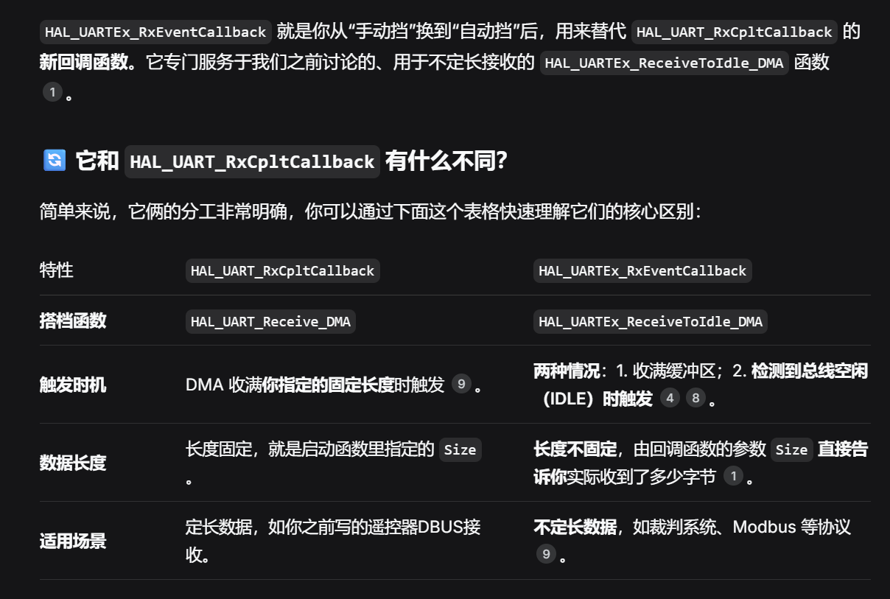

# TTL串口
###### ttl串口仅需2根数据线就可以完成两个设备的双向通信，两设备在数据线上按照约定好的频率切换高低电平，代表0和1，就可以完成通信。
### 连接方式：
###### 一台设备的Tx接另一台设备的Rx；除了数据线，有时需要两设备的GND相连，共地（规定0电势点）
#### 👌共地是两设备正常通信的前提。
# Background：
## USART
###### Universal Synchronous/Asynchronous Receiver/Transmitter
###### 通用 同步或异步 接收器和发送器

#### 👌TTL串口就是用的其中的Asynchronous（所以有时候会见到UART这种缩写）
## Baud Rate波特率
###### Baud Rate波特率：每秒传送的码元数量，也就是每秒多少次高低电平信号。
#### 👌默认情况下，ttl串口每传递一个字节（Byte）也就是8bit数据，还需要添加1位起始位和1位停止位，也就是每传送1字节信息需要10bit。
#### 👌所以！！！在115200bit/s的波特率下，1s可以传递11520字节数据
#### 👌通信的两设备需要使用相同的波特率才能正常通信。

# HAL库标准发送函数（接收就只要把Transmit改为Receive就好）
## 1.阻塞模式发送 HAL_UART_Transmit
这是最基础、最常用的发送函数，适合发送调试信息或小数据量场景。

```c
HAL_StatusTypeDef HAL_UART_Transmit(UART_HandleTypeDef *huart, uint8_t *pData, uint16_t Size, uint32_t Timeout);
```
参数说明：
huart：串口句柄，如&huart1（对应开发板C型的USART1）

pData：要发送的数据缓冲区指针

Size：发送的数据长度（字节数）

Timeout：超时时间（单位ms）

特点：

阻塞执行：函数会一直等待，直到数据发送完成或超时

简单可靠：发送期间CPU被占用，不能做其他事

适合：调试信息打印、小数据量发送

示例：
```c
uint8_t send_buf[] = "Hello RoboMaster!\r\n";
HAL_UART_Transmit(&huart1, send_buf, strlen((char*)send_buf), 1000);
```
## 2. 中断模式发送 HAL_UART_Transmit_IT
```c
HAL_StatusTypeDef HAL_UART_Transmit_IT(UART_HandleTypeDef *huart, 
                                        uint8_t *pData, 
                                        uint16_t Size);
```
特点：

非阻塞：函数立即返回，后台通过中断发送

效率高：发送期间CPU可以处理其他任务

注意：发送完成会触发中断，需要在回调函数HAL_UART_TxCpltCallback中处理后续逻辑

👍注：
中断模式接收 HAL_UART_Receive_IT
```c
HAL_StatusTypeDef HAL_UART_Receive_IT(UART_HandleTypeDef *huart,
                                       uint8_t *pData,
                                       uint16_t Size);
```
特点：

非阻塞：启动接收后立即返回，收到数据后触发中断

😘一次一用：每次调用只生效一次，收到指定字节后需要重新调用？！！！！

👌HAL_UART_RxCpltCallback 中处理完数据加入HAL_UART_Receive_IT这个就可以解决一次一用的问题。


## 3. DMA模式发送 HAL_UART_Transmit_DMA
```c
HAL_StatusTypeDef HAL_UART_Transmit_DMA(UART_HandleTypeDef *huart, 
                                         uint8_t *pData, 
                                         uint16_t Size);
```
特点：

最高效：数据通过DMA直接搬运，几乎不占CPU

适合：大量数据、图像传输、高频日志

👍注意：
HAL_UART_RxCpltCallback 只会在以下两种方式接收完成时被调用：

✅ 中断模式接收：HAL_UART_Receive_IT()

✅ DMA模式接收：HAL_UART_Receive_DMA()

# Q1：如何将stm32和电脑连接到一起进行通信？
# TTL串口转USB模块
###### 按照前文说的三根线连好后，这个模块就可以充当ttl与usb协议的翻译器，让stm32可以与电脑进行通信

# Q2：如何在电脑上看到stm32发来信息？
# 串口调试助手

# ✌️接收不定长数据————串口空闲中断
#### HAL_UARTEx_ReceiveToIdle 正是 STM32 HAL 库中专门为处理不定长数据接收而设计的新一代函数。

#### 这是一个函数系列，通常有三种模式：HAL_UARTEx_ReceiveToIdle()（阻塞）、HAL_UARTEx_ReceiveToIdle_IT()（中断）和 HAL_UARTEx_ReceiveToIdle_DMA()（DMA）。在 RoboMaster 这类高性能要求的场景中，最常用的是 HAL_UARTEx_ReceiveToIdle_DMA()。

#### 这个函数的核心思想是将“DMA接收”与“空闲中断检测”封装在一起，自动处理不定长数据。

```c
// 1. 在初始化中，启动“自动挡”接收 (代替你之前的 HAL_UART_Receive_DMA)
// 假设裁判系统用 huart2，缓冲区 256 字节
HAL_UARTEx_ReceiveToIdle_DMA(&huart2, referee_buffer, 256);
// 【经验】建议关掉半传输中断，减少不必要的干扰（因为半传输中断也会触发HAL_UARTEx_RxEventCallback这个中断）
__HAL_DMA_DISABLE_IT(&hdma_usart2_rx, DMA_IT_HT);


// 2. 实现这个新回调来处理数据 (代替你之前的 HAL_UART_RxCpltCallback)
void HAL_UARTEx_RxEventCallback(UART_HandleTypeDef *huart, uint16_t Size)
{
    if (huart->Instance == USART2) // 判断是裁判系统的串口
    {
        // Size 就是裁判系统发来的这一包数据的实际长度！不用自己算了。
        // 在这里调用你的解析函数
        ParseRefereeData(referee_buffer, Size);
        
        // 【重要】必须重新启动接收，等待下一包数据
        HAL_UARTEx_ReceiveToIdle_DMA(&huart2, referee_buffer, 256);
        __HAL_DMA_DISABLE_IT(&hdma_usart2_rx, DMA_IT_HT);
    }
}
```
### ✌️这个Size会直接返回实际上接收到的数据的实际长度，不用自己算了。