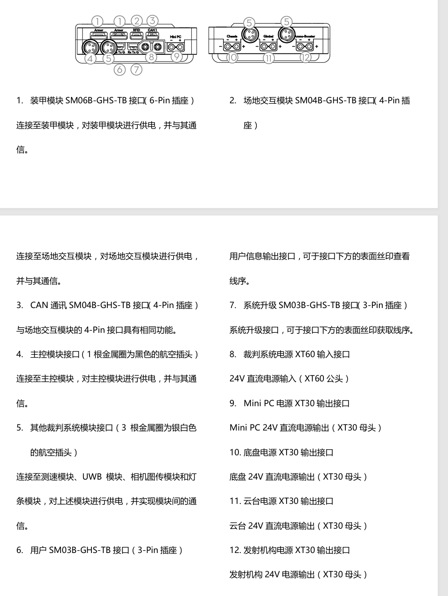
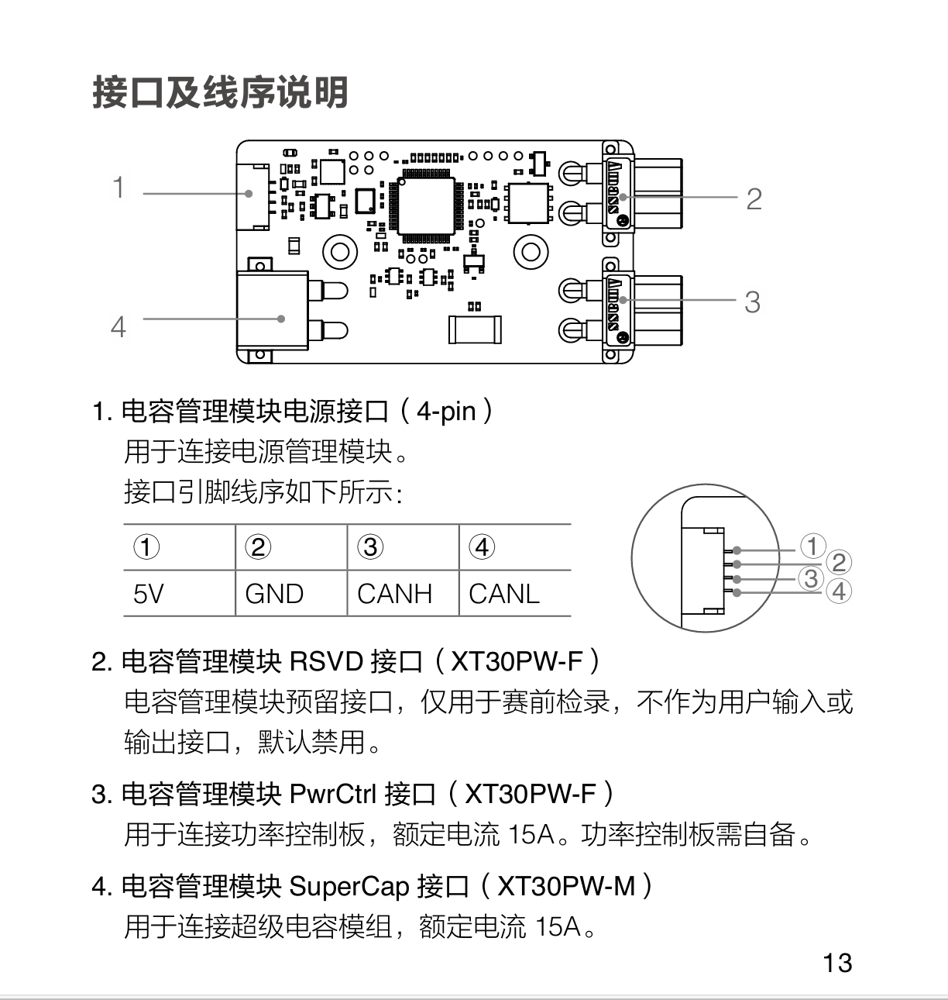
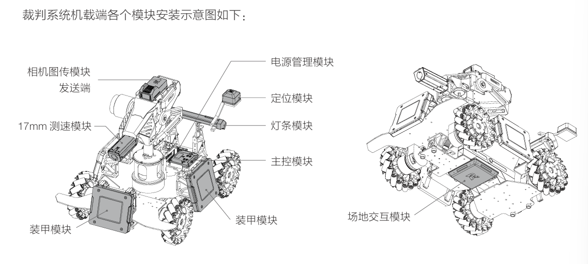
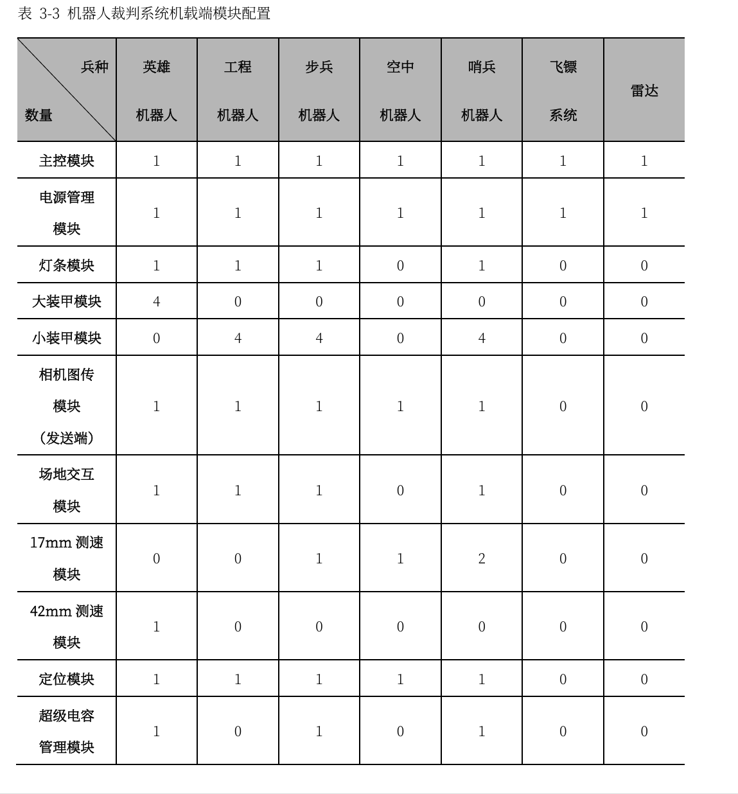

 # 一.裁判系统硬件
 ## 1.电源管理模块。
 ### （1）（供电+监测）可为机器人的底盘、云台、发射机构分别提供3个通道24V的直流电源输出，监测这3个通道的电流、电压并计算功率，然后根据服务器下发的控制指令执行电源输出通断控制操作。同时，电源管理模块还可提供5V、12V、24V直流电源供其他裁判系统模块使用。
 ### （2）（信息中转站）通信转发功能，可将各模块发送的数据包按照要求转发至目标模块。
 ### （3）使用时需通过XT60口为其供24V电。
 ### （4）血量为0时自动切断动力电源
 
 ## 2.装甲模块
 ### 机器人裁判系统的伤害感知部分，可安装于机器人周围外侧，用于检测机器人被弹丸攻击及碰撞的情况。 

### 12V供电
## 3.装甲支撑架
### 安装一个装甲模块需要使用两个装甲支撑架
## 4.测速模块
### 测量所经过弹丸的速度与频率，CAN通信+12V电源供电。

### 内置IMU，使用前对磁力计校准

### 12V供电
## 5.相机图传模块
### 分为接收端和发送端。接收端连接到电脑上，可作为遥控器使用。发送端需连接到电源管理模块。为用户提供机器人的第一人称视角，
## 6.定位模块
### 定位模块与场地基站进行通信实现定位。为比赛客户端小地图提供获得的数据，同时通过裁判系统电源管理模块的“用户接口”输出。
## 7.场地交互模块
### 通过标配的4-Pin连接线连接至电源管理模块，进行供电和通讯。实现IC卡的写入与读取操作。
## 8.灯条模块
### 显示机器人当前血量和状态

### 12V供电
## 9.超级电容管理模块
### 用于监测超级电容模组状态的单元，可检测超级电容模组的容值，实时监控其电压和容量。

### 5V供电

## 10.场地交互卡
### 配合裁判系统场地交互模块，可以实现该IC卡的写入与读取操作。
## 11.主控模块
### 监控整个系统的运行状态
# 二.整体安装

## 1.英雄
### 大装甲模块，42mm测速模块，相机图传模块（发送端） ，场地交互模块，定位模块 ，主控模块，电源管理模块，灯条模块，超级电容管理模块 
## 2.工程
### RMUC:
 小装甲模块 
 相机图传模块（发送端） 
 场地交互模块 
 定位模块 
 主控模块 
 电源管理模块 
 灯条模块
### RMUL：
 主控模块 
 电源管理模块 
 相机图传模块（发送端）
## 3.步兵
 小装甲模块 
 17mm测速模块 
 相机图传模块（发送端） 
 场地交互模块 
 定位模块 
 主控模块 
 电源管理模块 
 灯条模块 
 17mm荧光弹丸充能装置
 超级电容管理模块
## 4.空中机器人
 相机图传模块（发送端） 
 定位模块 
 主控模块 
 电源管理模块 
 17mm测速模块
## 5.烧饼
 小装甲模块 
 17mm测速模块 
 场地交互模块 
 定位模块 
 主控模块
 电源管理模块 
 灯条模块 
 17mm 荧光弹丸充能装置 
 超级电容管理模块 
 相机图传模块（发送端）
## 6.飞镖.雷达
 主控模块 
 电源管理模块

# 二.裁判系统软件（接收）
## 1.初始化（裁判系统的初始化和串口的初始化）
## 2.处理数据
### Data_Process函数：
（1）遍历整个接收缓冲区寻找帧头：防止粘包。虽然没有使用双缓冲区，但使能空闲中断并关闭了DMA半传输中断
（2）cmd_id为命令码，占据2字节，所以解包时高8位与低8位拼起来（data_length同）
（3）switch-case语句能迅速匹配相应的命令。eg：如果命令码是Referee_Command_ID_ROBOT_STATUS，Robot_Status【0】是机器人ID，对应到Rx_Buffer里就是buffer_index(帧头所在位置，即为整个包的起始位置)+7（SOF占1位，data_length占2位，seq 1位，CRC8 1位，cmd_id 2位）+i,以后的数据逐个排列，但i最大为data_length + 2（数据长度+CRC16校验）
（4） buffer_index += sizeof(Struct_Referee_Rx_Data_Game_Status) + 7;
原来的buffer_index加上收到的一整个包的长度，便于下一次遍历找SOF

# 三.裁判系统软件（发送）
## 1.Struct_Referee_UART_Data中没有CRC16，因为CRC16在uint8_t Data[121]中，
## 2.帧头的封装：帧头标识，数据长度（减去两字节的CRC16校验），包序，CRC8校验，命令码
## 3.交互层：子内容ID，发送方，接收方（+0x100,对应机器人的选手端）,图形地址，CRC16校验

# 四.CRC校验
## 1.原理：
    （1）、预置1个16位的寄存器为十六进制FFFF（即全为1），称此寄存器为CRC寄存器；
    （2）、把第一个8位二进制数据（既通讯信息帧的第一个字节）与16位的CRC寄存器的低
    8位相异或，把结果放于CRC寄存器，高八位数据不变；
    （3）、把CRC寄存器的内容右移一位（朝低位）用0填补最高位，并检查右移后的移出位；
    （4）、如果移出位为0：重复第3步（再次右移一位）；如果移出位为1，CRC寄存器与多
    项式A001（1010 0000 0000 0001）进行异或；
    （5）、重复步骤3和4，直到右移8次，这样整个8位数据全部进行了处理；
    （6）、重复步骤2到步骤5，进行通讯信息帧下一个字节的处理；
    （7）、将该通讯信息帧所有字节按上述步骤计算完成后，得到的16位CRC寄存器的高、低
    字节进行交换；
    （8）、最后得到的CRC寄存器内容即为：CRC码。
## 2.查表法（本质是位运算的批量预计算）
### 预计算所有字节值(0x00-0xFF)经过8次位运算后的结果 → 存入CRC8_TAB[256]
### 运行时直接查表：新CRC = CRC8_TAB[旧CRC ^ 数据字节]，等效于一次性完成8次位移+异或操作
### 初始CRC与数据字节异或，结果作为索引，直接到表中找到最终检验值
